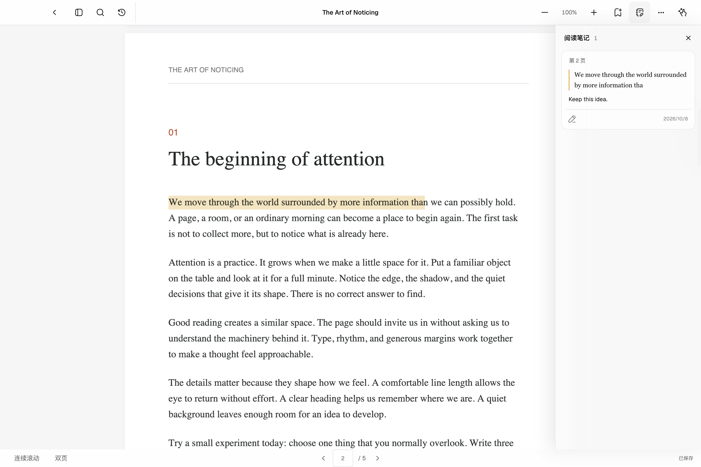
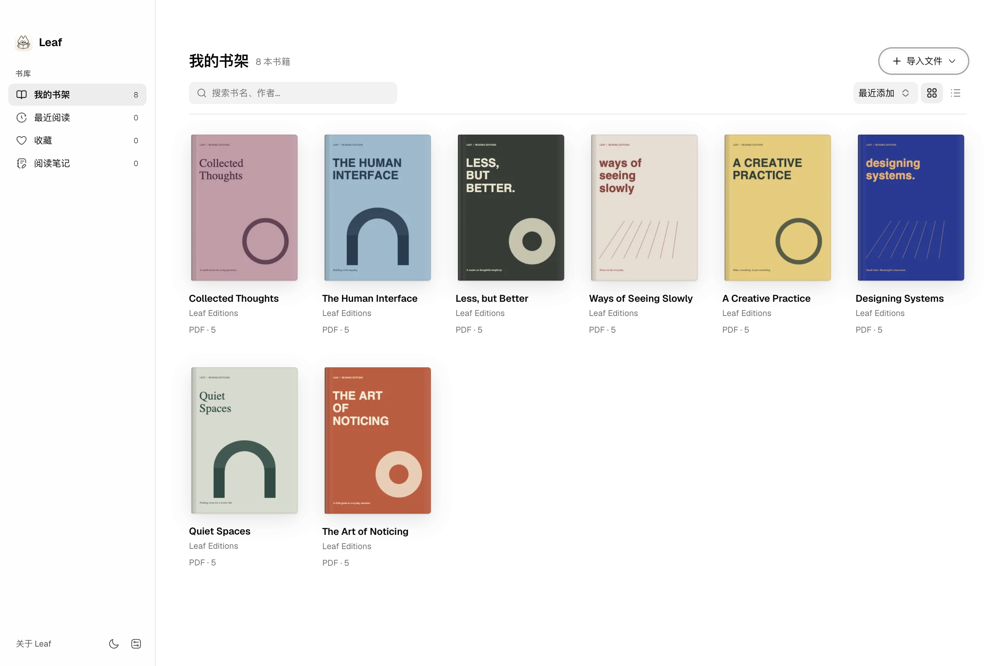

<div align="center">
  
  <h1>Leaf</h1>
  <p><strong>把注意力，留给正在读的这一页。</strong></p>
  <p>一款轻量的本地桌面阅读器，用插件扩展阅读格式与 AI 能力。</p>
  <p>macOS · Windows · 本地书架 · 离线阅读 · 无需账户</p>
  <p>
    <a href="https://github.com/c0sc0s/Leaf/releases/latest/download/Leaf-mac-arm64.dmg">下载 macOS 版（Apple Silicon）</a>
    ·
    <a href="https://github.com/c0sc0s/Leaf/releases/latest/download/Leaf-win-x64.exe">下载 Windows 版（x64）</a>
    ·
    <a href="https://github.com/c0sc0s/Leaf/releases">全部版本</a>
  </p>
</div>

<br />

<p align="center">
  <picture>
    <source media="(prefers-color-scheme: dark)" srcset="docs/previews/reader-dark.png" />
    
  </picture>
</p>

<p align="center"><sub>空间留给正文，想法留在页边。</sub></p>

## 读进去，也接得上

Leaf 从 PDF 阅读开始：打开一本书，接着上次的位置读；遇到值得留下的句子，选中、标记、写下想法。书架、阅读进度、书签和笔记都保存在本机，不需要注册账户。

需要阅读 Markdown，或想在阅读中向 AI 提问时，再安装对应插件。阅读格式与扩展功能可以按需安装、停用和卸载，让工具保持简单。

| 阅读体验           | 你可以做什么                                                          |
| ------------------ | --------------------------------------------------------------------- |
| **保留原版**       | 按 PDF 原有版面呈现文字、图片、图表和公式，选择、复制带文字层的内容。 |
| **自在翻阅**       | 连续滚动、双页布局、缩放和专注阅读，按自己的节奏看书。                |
| **从上次继续**     | 恢复阅读位置、缩放比例与布局，重新打开后接着读。                      |
| **找到，也回得来** | 用目录、缩略图、书签和全文搜索定位内容，通过导航历史返回。            |
| **随手留下想法**   | 高亮、划线与笔记自动保存，支持改色、编辑、撤销和重做。                |
| **带走你的笔记**   | 导出带批注的 PDF，或将阅读笔记导出为 Markdown。                       |

## 一个属于你的书架

拖入文件，或一次导入多份文档。通过收藏、最近阅读和阅读笔记整理书库，用书名、作者快速查找；封面网格和列表视图随时切换。文档导入后保存到本地书库，阅读和批注可以离线完成。

<p align="center">
  <picture>
    <source media="(prefers-color-scheme: dark)" srcset="docs/previews/library-dark.png" />
    
  </picture>
</p>

<p align="center"><sub>截图来自桌面应用，书籍为 Leaf 原创演示文档。</sub></p>

## 按需扩展

桌面应用默认安装并启用 PDF 阅读插件，Markdown 和 AI 是独立的可选插件。它们复用同一套书架、阅读会话和扩展入口。

| 插件              | 提供的能力                                                                           | 安装方式       |
| ----------------- | ------------------------------------------------------------------------------------ | -------------- |
| **PDF 阅读**      | 原版渲染、搜索、目录、缩略图、批注与批注 PDF 导出。                                  | 默认启用       |
| **Markdown 阅读** | 单文件与文件夹阅读、章节链接、本地图片、代码高亮、搜索、字号调整与批注。             | 在线或本地安装 |
| **AI 阅读助手**   | 针对选区提问、总结当前位置、结合原文回答、点击引用跳转，以及查看模型用量和执行记录。 | 在线或本地安装 |

### 安装、管理与更新

1. 打开「设置 → 插件 → 发现插件」，搜索或按类型浏览插件。
2. 查看插件详情、权限与依赖，确认后下载安装。
3. 在「已安装」中切换启停状态，通过更多操作卸载；发现页提供可用版本的手动更新。

也可以点击「安装插件包」，选择本机的 `.leaf-plugin` 文件。安装其他阅读插件后，可以卸载默认 PDF 插件；应用会保留至少一个启用的阅读插件。

### 把 Markdown 文件夹当作一本书

安装 Markdown 插件后，选择「导入文件」可将 `.md` / `.markdown` 文件作为一本书；选择「导入文件夹」则把文件夹中的 Markdown 文件作为同一本书的章节，本地图片一起保存，章节间的相对链接可以跳转。需要关联章节或本地图片时，请导入整个文件夹。

### 在原文旁边问 AI

安装 AI 插件后，在设置中填写 OpenAI 兼容服务的地址、模型和 API Key。选中文字后点击「问 AI」，或使用阅读工具栏里的「总结当前位置」，回答中的原文引用可以直接跳转。

AI 需要连接你配置的模型服务，会发送问题和回答所需的文档内容；模型服务的费用由该服务收取。桌面端的 API Key 通过系统凭据加密能力保存在本机。

## 白天清爽，夜晚柔和

支持浅色、深色和跟随系统，正文外观可以单独设置。阅读 PDF 中的照片或图表时，也可以保留文档的原始颜色。支持的平台提供毛玻璃窗口效果，工具和面板按需展开。

## 下载与开始阅读

| 平台                  | 安装包                                                                                   |
| --------------------- | ---------------------------------------------------------------------------------------- |
| macOS · Apple Silicon | [下载 DMG](https://github.com/c0sc0s/Leaf/releases/latest/download/Leaf-mac-arm64.dmg)   |
| Windows · x64         | [下载安装程序](https://github.com/c0sc0s/Leaf/releases/latest/download/Leaf-win-x64.exe) |

安装后打开 Leaf，点击「导入文件」或拖入 PDF，就可以开始阅读。

目前公开的最新安装包为 v1.5.2，发布于插件架构与在线市场上线之前；上面的插件功能和截图对应当前源码。体验当前完整功能可按下方步骤启动桌面开发版，后续安装包以 [Releases](https://github.com/c0sc0s/Leaf/releases) 为准。

## 开发与贡献

需要 **Node.js 22.18 或更新版本**。在仓库根目录执行：

```sh
npm ci
npm run desktop
```

开发应用首次启动也默认只启用 PDF。构建生成的插件包位于 `dist-plugins/`，可通过设置安装；也可从发现页在线安装。

| 命令                    | 用途                                                 |
| ----------------------- | ---------------------------------------------------- |
| `npm run dev`           | 启动浏览器开发环境。                                 |
| `npm run check`         | 检查依赖边界、代码、类型、格式，运行单元与集成测试。 |
| `npm run test:e2e`      | 验证浏览器与 Electron 用户流程。                     |
| `npm run build`         | 构建应用、平台服务、公共运行时与插件。               |
| `npm run build:plugins` | 构建独立的 `.leaf-plugin` 包。                       |
| `npm run dist:mac`      | 在 macOS 上生成 arm64 安装包。                       |
| `npm run dist:win`      | 在 Windows 上生成 x64 安装包。                       |

想了解工程或开发新插件，可以从这些文档开始：

- [架构与依赖边界](docs/architecture.md)：应用、公共协议、平台服务与插件的职责。
- [插件协议与开发](docs/plugins.md)：阅读格式、功能扩展、插件打包与在线目录发布。
- [开发、测试与打包](docs/development.md)：测试分层、正式应用验收与构建流程。

问题反馈与功能建议请提交到 [Issues](https://github.com/c0sc0s/Leaf/issues)，代码贡献欢迎通过 Pull Request 提交。

## 许可

本项目使用 MIT 许可证。第三方组件许可见 [THIRD_PARTY_NOTICES.md](THIRD_PARTY_NOTICES.md)。

---

<p align="center">
  <strong>Leaf</strong> · 一只猫，一本书，一段专注的时间。
</p>
