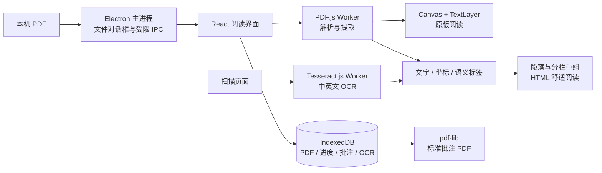

# Folio 技术调研与架构

## 需要解决的问题

PDF 原始排版适合打印，但屏幕宽度、个人字体偏好和夜间阅读需求各不相同。直接把整页画成图像能保持版面，却无法重新控制文字布局。Folio 同时保留可信的原版和可调整的文字排版，并让同一段文字的批注有对应位置。

调研依据包括 [Mozilla PDF.js 架构与入门](https://mozilla.github.io/pdf.js/getting_started/)、[PDFPageProxy API](https://mozilla.github.io/pdf.js/api/draft/module-pdfjsLib-PDFPageProxy.html)、[Electron 安全指南](https://www.electronjs.org/docs/latest/tutorial/security)、[Tauri 进程模型](https://tauri.app/concept/process-model/)、[pdf-lib API](https://pdf-lib.js.org/docs/api/) 和 [Tesseract.js 官方仓库](https://github.com/naptha/tesseract.js)。实现使用安装并锁定的具体库版本，API 以本机类型声明为准。

## 桌面与 PDF 引擎比较

| 方案                | 适合之处                                                            | 本项目的取舍                                                                                                                                                     |
| ------------------- | ------------------------------------------------------------------- | ---------------------------------------------------------------------------------------------------------------------------------------------------------------- |
| Electron + PDF.js   | 两个平台使用相同 Chromium；文字选择、DOM 重排、Worker/WASM 工具成熟 | 采用。安装体积和内存比系统 WebView 大，换取一致的渲染与 OCR 行为                                                                                                 |
| Tauri + PDF.js      | Rust 后端与系统 WebView，分发体积较小                               | Tauri 在 macOS 使用 WKWebView、Windows 使用 WebView2，需要额外验证文字选择、WASM、Worker、文件协议等平台差异                                                     |
| Qt + PDFium / MuPDF | 原版渲染性能好，适合原生桌面阅读                                    | 自定义可重排正文、文字选择和富文本交互需要再建设；PDFium 构建集成与 [MuPDF 的 AGPL/商业授权](https://github.com/ArtifexSoftware/mupdf/blob/master/COPYING)需考虑 |
| 商业 PDF SDK        | 复杂批注、表单、签名与排版重建有现成能力                            | 会引入授权和成本；当前核心范围不需要                                                                                                                             |
| 从零解析 PDF        | 可完全控制                                                          | PDF 字体、CMap、加密、透明度、颜色空间、图形状态、损坏文件容错范围很大，无法合理替代成熟引擎                                                                     |

PDF.js 的 display 层提供 `render()`、`getTextContent()` 和 `getStructTree()`。这支持从同一引擎得到忠实的原始图形与独立文字内容。自定义 HTML 不使用整页截图作为正文。

## 数据与进程

主进程只开放选择 PDF、读取被选择文件和导出文件三个受控操作，不向页面暴露任意路径读取或通用 IPC。Renderer 使用 sandbox、contextIsolation，关闭 Node.js 集成；阻止新窗口、外部导航与不需要的权限请求；仅允许当前窗口的剪贴板写入。CSP 允许本机脚本、Worker 和 WASM，应用运行时不需要外部网络。

渲染代码的依赖全部打包进 Vite 产物，主进程只依赖 Electron 和 Node 内置模块。生产安装包不重复携带整份前端 node_modules。

`Book.id` 是文件内容的 SHA-256。相同文件不会重复导入；同名但不同内容可并存。导入保存 Blob 副本，移动源文件不会导致书库失效。删除书籍同时删除批注与 OCR 数据。系统文件关联会将文件转入同一导入流程。

## 重排算法

1. 按需调用 `getTextContent({ includeMarkedContent: true })` 读取文本项、变换矩阵、字形尺寸与字体属性。
2. 将 PDF 坐标转换为页面坐标；同时保留 PDF 坐标框，用于标注和导出。
3. 若 `getStructTree()` 提供语义树，利用内容 ID、标题角色与结构遍历顺序辅助排序。
4. 无语义树时，依据基线距离重组行。只有足够多的正文文本分布在页面中线两侧、并且存在持续空白栏间距时，才按双栏顺序读取；横跨的标题作为上下分区边界。
5. 用字体大小中位数、垂直段间距、缩进、列表前缀推断标题、段落和列表。
6. 输出 `PageContent { text, tokens, blocks, source, tagged, columns, warnings }`。正文由 React 文本节点渲染，避免 PDF 文字被当作 HTML 执行。
7. 字体、行距和版心完全由应用控制；颜色主题直接作用于文字和背景。

这是可解释的版面启发式，无法恢复任意 PDF 的完整逻辑结构。数学公式、竖排、脚注、侧栏、跨页段落、嵌套表格、复杂多栏和缺失 ToUnicode 的字体需要更强的文档分析。在核心模式中保留原版切换，并在无语义标签的页面说明推断性质。

后续可引入 [Docling](https://docling-project.github.io/docling/concepts/docling_document/) / [PaddleOCR](https://github.com/PaddlePaddle/PaddleOCR/blob/main/docs/version3.x/pipeline_usage/PP-StructureV3.en.md) 的独立本机文档分析进程来输出标题、表格、图片及阅读顺序，再由同一 Block 模型渲染。此路线需额外模型体积、Python/推理运行时、资源调度和准确率验证；当前没有集成或宣称具备这些能力。服务端或云模型也可增强布局理解，但会改变默认离线与隐私模型，需要单独设计。

## 批注锚点与导出

每个文字项保存 canonical `start/end` 偏移和原版 PDF 矩形。舒适阅读的 DOM span 保存对应文字起点；PDF TextLayer 的文本项也映射到相同偏移。选区生成文字范围、摘录、颜色、标注类型及坐标矩形。

- 原版模式使用透明 SVG 矩形与下划线叠加，缩放时由 PDF Viewport 重新映射。
- 重排模式按文字偏移拆分文本节点，直接设置背景或 text-decoration。
- OCR 保存识别出的词框，并区分 `source: ocr`，避免将 OCR 文字偏移错误套到原 PDF 文本。
- 导出使用 PDF 的 `Annot` 字典，包含 `Highlight` / `Underline`、`Rect`、`QuadPoints`、颜色和 Unicode 笔记内容；原文件保持不变。

原版选区优先使用 TextLayer 实际选区框换算为 PDF 坐标；重排模式范围内的字符矩形按比例计算。对复杂字体、竖排或旋转文字，这只是近似定位。更精细的路线是基于字形进度与逐字符 quad 定位，并改善从重排文本返回原始字形的定位。标准批注保留可编辑性，不做不可逆的图像烧录。

pdf-lib 不支持编辑加密文档。应用允许 PDF.js 密码阅读，但密码不会持久化；加密文件的批注 PDF 导出会给出说明，Markdown 导出不受此限制。

## 性能和离线

PDF.js 在 Worker 中解析；原版只绘制当前页，最多按设备像素比 2 绘制 Canvas，控制高分辨率显存。缩略图进入可视范围才渲染。文本提取缓存最多 30 页，搜索顺序提取所有页面并报告进度、允许切换关键词取消旧搜索。原版页面切换取消渲染任务，关闭文档销毁 loadingTask 与 Worker。

OCR 是用户主动触发的逐页任务，使用内置 WASM 和中英文语言模型。识别后保存结构化文字与词框，后续搜索和重开直接使用本机结果。关闭阅读器后不更新已卸载视图；当前任务在 worker 完成后释放。超大文件和大页数文档仍需要实际设备性能测试，不声称固定的内存或响应时长。

## 验证范围

单元测试覆盖标题/段落/双栏/Tagged PDF 顺序、空页、部分文字框，以及标准批注 PDF 的结构与原文件不变。端到端测试使用真实 PDF 字节验证导入去重、选区批注、跨模式显示、深浅主题、导出和重新读取、阅读位置与笔记持久化、全文搜索、排版设置以及扫描件 OCR。

Windows 与 macOS 的 CI 分别构建安装包。macOS 本机验证可以检查沙箱、IPC、文件协议 Worker 与桌面渲染；它不能证明 Windows 的原生文件关联、NSIS 安装或系统行为。正式发布需要签名、公证和两平台真实设备验收。

## 许可

Electron：MIT；React：MIT；PDF.js：Apache-2.0；pdf-lib：MIT；Tesseract.js：Apache-2.0；Tesseract / tessdata 语言数据：Apache-2.0；idb：ISC；Lucide：ISC。发行时保留对应第三方许可与 Electron Chromium 的许可证文件。示例内容和封面由项目自行创作，无第三方图书资源。
