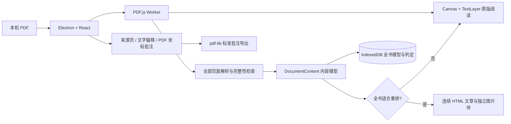

# Folio 技术调研与架构

## 需要解决的问题

PDF 原始排版适合打印，但屏幕宽度、个人字体偏好和夜间阅读需求各不相同。直接把整页画成图像能保持版面，却无法重新控制文字布局。Folio 同时保留可信的原版和可调整的文字排版，并让同一段文字的批注有对应位置。

调研依据包括 [Mozilla PDF.js 架构与入门](https://mozilla.github.io/pdf.js/getting_started/)、[PDFPageProxy API](https://mozilla.github.io/pdf.js/api/draft/module-pdfjsLib-PDFPageProxy.html)、[Electron 安全指南](https://www.electronjs.org/docs/latest/tutorial/security)、[Tauri 进程模型](https://tauri.app/concept/process-model/)、[pdf-lib API](https://pdf-lib.js.org/docs/api/)。实现使用安装并锁定的具体库版本，API 以本机类型声明为准。

## 桌面与 PDF 引擎比较

| 方案                | 适合之处                                                            | 本项目的取舍                                                                                                                                                     |
| ------------------- | ------------------------------------------------------------------- | ---------------------------------------------------------------------------------------------------------------------------------------------------------------- |
| Electron + PDF.js   | 两个平台使用相同 Chromium；文字选择、DOM 重排、Worker/WASM 工具成熟 | 采用。安装体积和内存比系统 WebView 大，换取一致的渲染和文字选择行为                                                                                              |
| Tauri + PDF.js      | Rust 后端与系统 WebView，分发体积较小                               | Tauri 在 macOS 使用 WKWebView、Windows 使用 WebView2，需要额外验证文字选择、WASM、Worker、文件协议等平台差异                                                     |
| Qt + PDFium / MuPDF | 原版渲染性能好，适合原生桌面阅读                                    | 自定义可重排正文、文字选择和富文本交互需要再建设；PDFium 构建集成与 [MuPDF 的 AGPL/商业授权](https://github.com/ArtifexSoftware/mupdf/blob/master/COPYING)需考虑 |
| 商业 PDF SDK        | 复杂批注、表单、签名与排版重建有现成能力                            | 会引入授权和成本；当前核心范围不需要                                                                                                                             |
| 从零解析 PDF        | 可完全控制                                                          | PDF 字体、CMap、加密、透明度、颜色空间、图形状态、损坏文件容错范围很大，无法合理替代成熟引擎                                                                     |

PDF.js 的 display 层提供 `render()`、`getTextContent()` 和 `getStructTree()`。这支持从同一引擎得到忠实的原始图形与独立文字内容。自定义 HTML 不使用整页截图作为正文。

## 数据与进程

主进程只开放选择 PDF、读取被选择文件和导出文件三个受控操作，不向页面暴露任意路径读取或通用 IPC。Renderer 使用 sandbox、contextIsolation，关闭 Node.js 集成；阻止新窗口、外部导航与不需要的权限请求；仅允许当前窗口的剪贴板写入。CSP 允许本机脚本、Worker 和 WASM，应用运行时不需要外部网络。

渲染代码的依赖全部打包进 Vite 产物，主进程只依赖 Electron 和 Node 内置模块。生产安装包不重复携带整份前端 node_modules。

`Book.id` 是文件内容的 SHA-256。相同文件不会重复导入；同名但不同内容可并存。导入保存 Blob 副本，移动源文件不会导致书库失效。删除书籍同时删除批注、全书内容模型及兼容保留的旧 OCR 数据。系统文件关联会将文件转入同一导入流程。

## 全书内容模型与判定

`DocumentContent` 包含所有 `PageContent`、总页数、模型版本、分析时间、整本 `suitable` 和带来源页码的 `issues`。页面只保留来源与坐标，统一阅读没有固定页宽、页高或逐页模式。各页内容块按全文顺序进入同一个连续文章；页码标签用于定位和核对。

1. 遍历从 1 到 `numPages` 的所有页面，包括发生问题页之后的页面。每页失败转为诊断，不停止后续检查。分析期间默认原版；只在整本分析完成后选默认模式。
2. `getTextContent({ includeMarkedContent: true })` 提取文字、变换矩阵与位置，维护嵌套标记内容栈。保留所有文字，包括页眉页脚，不按元数据或位置删除正文。
3. `getStructTree()` 的内容 ID 与角色决定 Tagged PDF 的逻辑顺序，支持 H1–H6、P、LI、Quote/BlockQuote、Caption、Figure、Formula 和 Table；对同一基线的不同结构片段分别组行。标签的重要性和作用见 [PDF Association 对逻辑结构与阅读顺序的说明](https://pdfa.org/you-tagged-pdfs-for-screen-readers-turns-out-the-machines-needed-it-too/)。
4. 未标记文字按基线组行，用字符数量加权的字体中位数推断正文与标题，依据间距、缩进和列表前缀拆块。只有持续栏间距与足够多的长文字行才接受双栏；多列、表格状短文本、重叠文字和不完整语义覆盖会产生诊断。
5. 用 `getOperatorList()` 与 `render({ recordOperations: true })` 记录绘图边界。同一 intent 与 annotationMode 保证绘图索引对应。渲染边界 API 见 [PDF.js API 源码文档](https://mozilla.github.io/pdf.js/api/draft/api.js.html)；适配安装并锁定的 PDF.js 版本，边界 API 缺失或发生变化时安全回退原版。
6. 为位图、矢量路径、遮罩、渐变和带标签的公式/表格确定局部区域，合并相连图形，并保留其中的标签文字。局部 PNG 保存为独立 figure 块；图片内部文字的 token 来源仍保存在模型，正文及图注由 DOM 排版。文档开头的全页纯色矩形记录为背景样式，统一布局由阅读主题控制底色。
7. 检查绘图区域与正文是否能完整拆分，以及全部文字 token 和绘图区域是否进入模型。区域接近整页、整页位图、文字参与裁剪、字符编码缺失、复杂字形、方向不支持、未保留表单/批注、提取异常或图像缓存超限都会使整本不适合统一阅读。
8. 只有全部页面完成且没有诊断，才默认统一阅读。其他文档整本原版，不逐页混用，也不使用整页截图填补失败页；首版不主动 OCR。

默认判断不能替代任意 PDF 的人工语义校验。PDF 标签可能错误，启发式也可能误判；首版采用保守阈值，并始终提供整本原版核对。可用文档的模式选择按书籍保存，自动判断仅用于初次默认选择。无法完整建立模型的文档保持原版，统一阅读入口提供全书诊断原因。

后续可将本机 Docling 等布局分析器作为提取提供方接入相同内容模型，但仍必须通过全书完整性和阅读顺序检查，不能通过局部成功放宽整本规则。

## 批注锚点与导出

每个文字项保存 canonical `start/end` 偏移和原版 PDF 矩形。统一阅读的 DOM span 保存对应文字起点；PDF TextLayer 的文本项也映射到相同偏移。选区生成文字范围、摘录、颜色、标注类型及坐标矩形。

- 原版模式使用透明 SVG 矩形与下划线叠加，缩放时由 PDF Viewport 重新映射。
- 重排模式按文字偏移拆分文本节点，直接设置背景或 text-decoration。
- 连续文章中跨原始页边界的选区按来源页拆分，使用同一 IndexedDB 事务保存；旧批注若文字偏移改变，仅在摘录唯一匹配时重定位，避免标记错误文字。旧 OCR 批注保留原版矩形及笔记。
- 导出使用 PDF 的 `Annot` 字典，包含 `Highlight` / `Underline`、`Rect`、`QuadPoints`、颜色和 Unicode 笔记内容；原文件保持不变。

原版选区优先使用 TextLayer 实际选区框换算为 PDF 坐标；重排模式范围内的字符矩形按比例计算。对复杂字体、竖排或旋转文字，这只是近似定位。更精细的路线是基于字形进度与逐字符 quad 定位，并改善从重排文本返回原始字形的定位。标准批注保留可编辑性，不做不可逆的图像烧录。

pdf-lib 不支持编辑加密文档。应用允许 PDF.js 密码阅读，但密码不会持久化；加密文件的批注 PDF 导出会给出说明，Markdown 导出不受此限制。

## 性能和离线

PDF.js 在 Worker 中解析；原版只绘制当前页，最多按设备像素比 2 绘制 Canvas，控制高分辨率显存。缩略图进入可视范围才渲染。文本提取缓存最多 30 页，搜索顺序提取所有页面并报告进度、允许切换关键词取消旧搜索。原版页面切换取消渲染任务，关闭文档销毁 loadingTask 与 Worker。

全书分析按页顺序进行，逐页释放离屏 Canvas，给事件循环让出时间，并报告已检查页数。模型按文件 SHA-256 和内容版本缓存于 IndexedDB；再次打开复用判定与图片资产。图片 data URL 总缓存限制为 48 MiB，超限产生诊断并保留原版。关闭文档取消分析、搜索并销毁 loadingTask 与 Worker。原版与统一文章的正文均使用本机资源，不上传文件。

超大文档仍需实际设备性能验证。首版在内存中保留整本模型并用 DOM 连续排版，尚未实现全书块虚拟化，不承诺固定内存或分析耗时。

## 验证范围

单元测试覆盖标题/段落/双栏/Tagged PDF 顺序、文字矩形、标准批注导出，以及完整页数、末页失败、token 保留与图片资产完整性。端到端用真实 PDF 验证整本连续文章、照片与矢量架构图、Tagged PDF 的标题/引用/列表/图注/公式和图片逻辑顺序、后半本扫描页回退并继续检查末页、歧义表格回退、整本切换、跨页批注、深浅主题、导出、搜索和持久化。

Windows 与 macOS 的 CI 分别构建安装包。macOS 本机验证可以检查沙箱、IPC、文件协议 Worker 与桌面渲染；它不能证明 Windows 的原生文件关联、NSIS 安装或系统行为。正式发布需要签名、公证和两平台真实设备验收。

## 许可

Electron：MIT；React：MIT；PDF.js：Apache-2.0；pdf-lib：MIT；idb：ISC；Lucide：ISC。发行时保留对应第三方许可与 Electron Chromium 的许可证文件。示例内容和封面由项目自行创作，无第三方图书资源。
