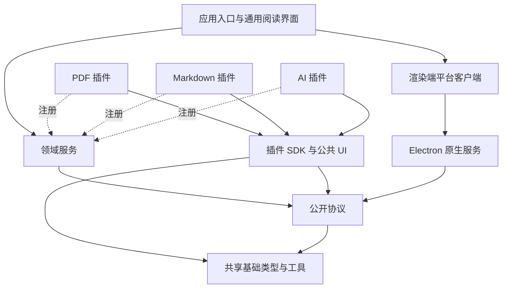

# 架构

Leaf 需要在增加文档格式和功能时复用同一套阅读体验，并允许用户卸载不需要的能力。因此应用持有文档数据和阅读会话，插件通过公开协议提供格式实现或功能扩展。只有应用入口负责组装各层。

应用更新属于桌面平台能力：`electron/platform/updater.ts` 管理检查、下载与安装状态，`updateRuntime.ts` 适配原生更新器、签名能力、可信 IPC 与检查定时器；`rendererFlush.ts` 管理关闭和升级共用的保存握手。渲染端通过 `UpdatesClient` 订阅状态，关于页面只负责展示与触发操作。更新协议位于 `@leaf/contracts/transport`，不对插件暴露安装权限。

```text
src/
  app/                         React 页面、交互与服务组装
    library/                   书架
    reader/                    通用阅读界面、导航、批注工具、笔记
    plugins/                   插件管理与扩展插槽
    settings/                  应用偏好
    compose.ts                 组装领域服务和平台实现
    start.tsx                  启动、文件打开事件、关闭保存
  core/                        与 React、Electron 无关的领域逻辑
    documents/                 格式选择、导入、文档句柄与资源生命周期
    library/                   文档管理与阅读进度
    reader/                    会话、导航历史、书签、视图绑定与续读
    annotations/               批注、笔记、撤销和重做
    plugins/                   注册、依赖、启停与卸载约束
    settings/                  偏好
  platform/                    渲染端的平台实现
    files/                     文件选择、读取、保存
    plugins/                   安装客户端、动态模块加载、后台 RPC
    repositories/              领域仓储实现
    transport/                 存储传输、保存协调与桌面接口类型

packages/
  shared/src/                  JSON 类型、事件、异步队列、缓存、生命周期
  contracts/src/               唯一的文档、阅读、批注、插件和平台协议
  plugin-sdk/src/              插件注册、作用域、视图与 React 挂载辅助
  ui/src/                      共享控件、图标、动效、阅读组件和偏好接口

electron/
  main.ts                      窗口、原生服务、IPC 与应用协议组装
  preload.cts                  类型化的最小桌面桥接
  platform/                    文件、窗口、资源响应、凭据
  storage/                     SQLite Worker、仓储、内容文件、备份
  plugins/                     插件包校验、安装、资源服务
    backend/                   插件后台进程、请求、取消与关闭

plugins/
  pdf/src/                     PDF 文档解析、定位、视图、搜索与导出
  markdown/src/                Markdown 文档导入、解析、定位与视图
  ai/src/
    models/                    配置与模型接入
    agent/                     Loop、Context、工具执行与 Trace
    document-tools/            基于通用文档协议的内容、搜索、目录工具
    features/ask/              阅读问答的 Prompt、上下文与会话业务
    backend/                   模型后台服务与凭据接入
    ui/                        问答面板、引用、模型设置与执行记录

scripts/                       构建、依赖检查、开发服务、打包与验证
tests/                         宿主单元、跨层集成、用户流程与正式包测试
site/                          独立的产品网站
```



应用不直接导入任何插件实现。插件只依赖自己的代码和公开包；公共包不能反向依赖应用、原生服务或插件。`npm run check:architecture` 自动检查这些规则，`core` 还限制为只依赖领域内部、`contracts` 和 `shared`。

公共包和插件的测试位于各自的 `tests/`，宿主测试与跨层验收位于根目录 `tests/`。领域测试使用公开协议替身，原生集成和格式实现分别在自己的边界内验证。目录、运行入口和验收范围见 [开发与验证](development.md#测试归属)。

## 阅读能力如何复用

格式插件提供 `DocumentProvider` 和对应的 `ViewFactory`。Provider 判断输入是否可读取，将文件规范化为 `DocumentDraft`，并打开 `DocumentHandle`。Handle 提供定位校验和标签，以及可选的内容读取、搜索、目录、章节导航、缩略图、图片和导出能力。

`ReadingSession` 持有文档句柄、批注和书签。视图向会话发出就绪、位置、选区、批注点击或错误事件；会话通过 `ViewCommands` 控制跳转、恢复位置、外观、搜索和批注展示。通用界面只根据声明的能力显示操作。

`Locator` 包含文档 ID、内容版本、插件定位格式及版本和 JSON payload。应用存储、传递和请求插件校验这些位置。PDF 页码、坐标和 Markdown 章节、文本偏移由各自插件解释。

批注的一条记录可以包含多个定位目标。应用统一处理颜色、笔记、撤销、重做和保存；插件把目标投射到自己的渲染结果。PDF 使用坐标覆盖层，Markdown 使用文本区间。两种格式共享同一个批注工具栏和笔记面板。

## 文件与数据

SQLite 和内容文件由一个存储 Worker 管理。领域仓储分别持有文档、批注、阅读位置、书签、偏好、插件状态、插件私有数据和任务记录。文档内容按 SHA-256 存储，资源路径属于文档，打开文档时获取租约，关闭后释放。

插件私有数据按插件 ID、文档作用域和 key 隔离。卸载插件保留其数据，重新安装后可继续使用；删除文档会删除与该文档相关的记录。批注提交先写入存储，再更新领域状态；笔记编辑和阅读位置通过保存协调器在切换、卸载或关闭窗口前完成保存。

当前存储结构有独立的 application ID 和 schema version。启动只创建或打开这一套结构，未知结构会报错。应用使用 `reader/` 数据目录，没有历史数据导入或旧应用兼容路径。

## 插件生命周期

插件包包含 manifest、模块、样式、Worker 和资源。安装服务校验 API 版本、依赖、文件路径和哈希，并写入按插件 ID 与包哈希区分的目录。重新安装会校验并修复损坏的文件。渲染端按依赖顺序激活插件，只接受 manifest 声明的贡献项。

注册、订阅和后台请求属于插件作用域。停用或卸载前完成保存并关闭相关阅读会话，然后取消作用域和后台进程，清理贡献项与样式。组件生命周期不会改变插件安装状态。

默认安装 PDF。Markdown 和 AI 不被应用静态打包引用，通过独立包安装。启停与卸载会检查依赖和最后一个阅读插件约束。某种格式插件缺失时，书架保留文档数据，并提示安装对应插件。

权限是宿主服务访问检查。当前插件运行于应用渲染环境，后台插件运行于 Node 进程，安装来源应当可信；这套机制没有提供对恶意插件的完整安全沙箱。

## AI 分层

模型层持有服务配置、鉴权、流式 API 和供应商用量解析。Agent 层管理多轮执行、消息预算、工具调用、取消和步骤上限，并产生模型与工具的 Trace。业务层决定阅读问答的 Prompt、初始上下文、允许的工具、对话保存与引用呈现。

文档工具只调用 `DocumentHandle` 的能力，通过分块读取、搜索和目录取得内容并生成引用，支持任何实现相应协议的阅读插件。问答中引用使用原文的 Locator，跳转由阅读会话完成。

Trace 是跨模型调用与工具执行的观测数据，使用宿主通用任务存储保存。面板显示每次完成回答的模型、服务返回的 token 用量与执行记录；服务未返回用量时显示未知。API Key 由原生凭据服务保管，不进入渲染端的公开配置。

## 构建边界

公共运行时通过 import map 共享 React、Motion、SDK 和 UI，避免动态插件拥有不同的 React 或 UI Context。各插件分别构建自己的实现、Worker、样式和资源，再生成 `.leaf-plugin` 包。应用构建只引用公共运行时和宿主代码。Electron 构建只包含通用原生服务。
