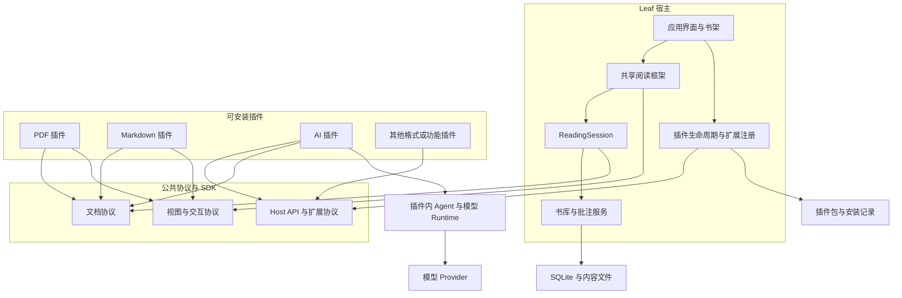

# Leaf 新架构与重构方案

本文定义 Leaf 的目标架构及重构范围。状态：目标设计，尚未实施。现状依据是当前工作树源码，目标依据是用户在本轮讨论中确认的产品约束；历史 Markdown 仅用于寻找线索，其中的描述需要回到源码和测试核实。最终项目只有新架构的一套入口、业务模型、协议和存储实现。

Leaf 的基础产品是轻量阅读宿主。宿主提供书架、共享阅读框架、数据存储和插件管理；PDF、Markdown 以及 AI 都通过插件接入。PDF 随应用默认安装并启用，用户启用另一种阅读插件后可以卸载 PDF。正常可阅读状态下至少有一个可用且启用的阅读插件，AI 等功能插件不计入这个数量。

本轮目标包含独立打包、动态安装、启用、停用、卸载和升级插件。首轮发行支持经验证的官方插件包。第三方代码的隔离执行属于后续能力，不能把官方插件的共享进程运行方式宣称为不可信代码的沙箱。

## 本轮核对的代码现状

核对时间：2026-09-30，包含当前未提交的 AI 与 Electron TypeScript 变更。以下是直接从源码确认的结构，新架构的行为由实际运行和测试验证。

| 当前边界       | 源码依据                                                                                                                                                                         | 迁移需要处理的内容                                                                  |
| -------------- | -------------------------------------------------------------------------------------------------------------------------------------------------------------------------------- | ----------------------------------------------------------------------------------- |
| 应用入口       | [main.tsx](../../src/main.tsx)、[App.tsx](../../src/App.tsx)                                                                                                                     | 启动协调、页面组合及带格式名称的文件入口                                            |
| 内置格式选择   | [importBook.ts](../../src/features/library/importBook.ts)、[BookReader.tsx](../../src/features/reader/BookReader.tsx)、[import.ts](../../electron/import.ts)                     | 导入、正文选择及系统文件过滤都有 PDF/Markdown 分支，改为 Provider 和格式贡献        |
| PDF            | [usePdfDocument.ts](../../src/features/reader/hooks/usePdfDocument.ts)、[PDFViewport.tsx](../../src/features/reader/viewport/PDFViewport.tsx)                                    | PDF.js、页面缓存、虚拟化和位置行为归格式插件                                        |
| Markdown       | [markdownService.ts](../../src/features/reader/markdownService.ts)、[MarkdownReader.tsx](../../src/features/reader/MarkdownReader.tsx)                                           | Worker 文档服务可复用；正文适配与完整阅读界面需要拆开                               |
| 共享阅读行为   | [useAnnotations.ts](../../src/lib/useAnnotations.ts)、[useReadingPersistence.ts](../../src/features/reader/hooks/useReadingPersistence.ts)                                       | 已共享保存、撤销及续读策略；服务状态仍依附 React 和直接存储调用，抽成业务服务       |
| 格式耦合的数据 | [types.ts](../../src/types.ts)、[schema.ts](../../electron/storage/schema.ts)                                                                                                    | 核心含格式枚举、页码、PDF 几何和 Markdown 章节结构，需要开放身份、资源与 Locator    |
| AI 接入        | [Reader.tsx](../../src/features/reader/Reader.tsx)、[useAsk.ts](../../src/features/ai/useAsk.ts)、[runtime.ts](../../src/ai/runtime.ts)、[document.ts](../../src/ai/document.ts) | 两个阅读器直接接线；Loop 已可注入 chat/tools；AI 自有文档适配及文本缓存改用公共能力 |
| 系统与存储     | [main.ts](../../electron/main.ts)、[client.ts](../../electron/storage/client.ts)、[contract.ts](../../electron/contract.ts)                                                      | 存储已用 Node Worker；模型服务直接驻于主进程；通用桥接与 AI 私有契约需要分离        |

当前是内置模块和按需加载阅读器，独立插件安装、贡献注册及公开 SDK 尚待建设。现有公共 UI、批注操作、Worker 客户端和 SQLite 机制中符合新边界的实现可以复用，并统一接入新协议。

## 产品约束

1. 格式插件提供正文与格式适配。工具栏、批注管理、书签、笔记、导航历史、续读和通用操作流程由宿主共享。
2. PDF 与 Markdown 实现相同的协议。新增格式无需向宿主增加格式枚举或格式分支。
3. AI 是功能插件。它消费文档和阅读会话协议，注册选区操作、侧栏和设置，不依赖 PDF 或 Markdown 插件的内部代码。
4. 卸载插件保留书籍、批注、阅读状态及插件数据。删除数据是单独的用户操作。安装兼容实现后可以恢复使用。
5. 插件的重量依赖、资源和计算线程随插件安装及按需加载。没有安装 AI 时不运行 Agent 或模型服务；没有安装 PDF 时不加载 PDF.js、字体、CMap 或 PDF 导出依赖。
6. 新系统使用本地 SQLite、内容文件、事务、备份、退出前提交和文档计算服务。可复用符合新边界的算法与基础实现，最终数据模型和调用路径统一使用新协议。
7. 完成重构后删除旧应用入口、旧业务模型、旧协议和旧存储调用路径。新系统不包含旧应用兼容层、旧数据自动导入、回填或新旧逻辑分流。

## 最终架构



图中箭头表示使用接口。宿主运行时通过注册表发现实现，不直接导入具体插件源码。协议与 SDK 不依赖宿主业务实现或任何文件格式。

## 分层和职责归属

| 层             | 拥有的职责                                                                | 对外提供                                       |
| -------------- | ------------------------------------------------------------------------- | ---------------------------------------------- |
| 应用展示       | 书架、设置、插件管理、共享阅读界面与交互状态                              | 用户操作入口、UI 扩展槽位                      |
| 宿主业务       | 导入流程、书籍生命周期、阅读会话、批注与书签管理、续读和导出流程          | 文档与阅读业务服务                             |
| 公共协议与 SDK | 文档身份、内容、位置、视图、能力、扩展、Host API 和传输契约               | 有版本的接口、共享组件与开发辅助工具           |
| 插件实现       | 格式解析与视图适配，或独立功能的业务与界面                                | Provider、视图工厂、命令、侧栏、设置和可选服务 |
| 平台接入       | Electron、IPC、浏览器开发传输、SQLite、内容文件、凭据、插件安装与资源加载 | 受控平台操作和协议传输                         |

业务接口可跨平台实现，但进程边界由平台层承担。逻辑分层不等于每层独占一个进程。通用任务和观测设施横跨上述模块，保持与格式和 AI 业务无关。

### 公共层与类型归属

宿主 Renderer、Electron 和插件都需要复用通用类型与基础工具。公共层由 `packages/shared`、`packages/contracts` 和 `packages/ui` 提供；`packages/plugin-sdk` 将公开协议与开发辅助组合成插件接入入口。公共层按职责组织，各包仅依赖自己需要的入口。

| 共享内容         | 唯一归属                          | 示例与边界                                                       |
| ---------------- | --------------------------------- | ---------------------------------------------------------------- |
| 通用基础类型     | shared 的 types、lifecycle 等入口 | JsonValue、通用结果类型、Disposable；不认识书籍、格式、AI 或平台 |
| 公开业务协议     | contracts 的对应领域入口          | 文档身份、Locator、Annotation、Manifest、Host API 与传输 DTO     |
| 通用基础实现     | shared 的对应功能入口             | 队列、取消、缓存、事件、资源释放及 Worker 客户端                 |
| 共享展示组件     | ui                                | Button、Dialog、目录树和公共样式；接受数据及回调                 |
| 宿主业务内部类型 | core 的所属模块                   | 导入协调状态、撤销记录等实现细节                                 |
| 插件内部类型     | 插件自己的模块                    | PDF 原生对象、Markdown AST、AI 消息与模型 Provider DTO           |

`contracts` 可以通过 type-only 导入使用 shared 的基础类型，公开入口需要时重导出同一定义，不复制另一份。公开协议在 contracts 定义一次；模块内的实现类型留在所属模块，按实际跨模块需求提取。基础包不依赖 contracts、SDK、宿主或插件，也不预建尚无消费者的通用类型。

`plugins/ai/shared` 仅供 AI 插件内部模块共享跨进程 DTO，作用域限于该插件；全局基础类型归 `packages/shared`。

### 共享阅读框架

宿主的 `ReaderShell` 提供阅读容器、工具栏、侧栏、目录树、搜索结果、书签、笔记编辑器、选区工具栏、状态栏和设置入口。插件只挂载正文视图，以及通过扩展点提供自己的控件。

`ReadingSession` 协调一次打开文档的生命周期。它拥有文档句柄、视图句柄、当前选区、当前位置、导航历史和异步任务，连接批注、书签与持久化服务。React Hook 订阅会话状态和提交命令，不承担格式解析或 Agent 执行。

| 能力 | 宿主实现一次                                 | 格式插件实现                             |
| ---- | -------------------------------------------- | ---------------------------------------- |
| 渲染 | 容器、加载状态、公共控件、错误恢复与布局协调 | PDF Canvas 或 Markdown DOM、格式特有布局 |
| 选区 | 选区状态、复制、操作菜单、菜单定位与扩展动作 | 捕获正文选区并生成文档锚点与视图矩形     |
| 批注 | 类型、颜色、笔记、保存、事务、撤销与重做     | 定位锚点、绘制或装饰批注、报告标记点击   |
| 书签 | 创建、删除、列表、保存和用户标题             | 捕获位置、提供位置标签、跳转             |
| 续读 | 保存时机、恢复流程、失败提示与退出前提交     | 精确捕获和恢复视图位置                   |
| 目录 | 树组件、选中状态、任务状态和点击行为         | 提供层级及位置                           |
| 搜索 | 输入、取消、结果列表、状态与跳转流程         | 格式相关文本索引、搜索结果与匹配定位     |
| 导出 | 菜单、文件保存、任务状态、通用笔记导出       | 写回 PDF 等格式特有导出                  |

正文缩放、字体大小、连续布局和双页布局不是同一个操作。视图按能力提供它支持的设置，宿主用公共控件呈现对应设置；核心不把所有文档强制装进 PDF 的缩放和页面布局模型。

共享阅读组件通过 SDK 的公开 UI 入口提供。插件可用这些组件增加设置和控件，无需复制设计系统；核心选区工具栏通过动作注册表获取 AI 等入口，源码中不包含必填的 `onAsk` 或固定 AI 图标。

### 格式插件

一个格式插件注册文档 Provider 和匹配的视图工厂。Provider 负责识别、导入、打开、内容提取、目录、搜索、位置编解码和资源生命周期；视图负责正文渲染、交互适配和批注呈现。

Provider 与视图共享同一打开文档实例。阅读搜索和 AI 搜索消费相同的文档能力与缓存，不额外在 AI 层建立全书文字缓存。缓存和索引可以不同，但由格式插件统一拥有和限制，而不是由调用方自行维护。

格式特有 Worker、WASM、字体和解析库进入插件包。默认的 PDF 插件与其他插件走相同注册、加载和卸载流程，宿主不保留 PDF 专用分支。

### 功能插件

功能插件消费 Host API 与能力协议，注册命令、选区动作、侧栏、设置、导出器或可选服务。贡献点按能力定义，插件可以同时贡献格式和功能，不用固定互斥的插件类型枚举。

AI 插件内部维持四个职责：模型接入、Agent Runtime、业务 harness、文档工具。问答、总结、翻译分别提供业务策略和输出处理，共用插件内的 Agent 和模型模块。它们不成为宿主默认依赖；多个独立插件确实需要这些实现时，再提取可选代码包或注册版本化 Runtime 服务。

## 协议设计

以下接口定义目标边界，名称可作为首轮协议实现的起点。跨进程部分使用可序列化 DTO，本地句柄的方法由 SDK 代理；DOM、函数、AbortSignal 和 React 对象不直接进入 IPC。

### 文档身份和持久位置

```ts
import type { JsonValue } from '@leaf/shared/types';

interface Locator {
  documentId: string;
  revision: string;
  schema: string;
  version: number;
  payload: JsonValue;
}

type ContentBlock =
  | { id: string; kind: 'text'; locator: Locator; text: string }
  | { id: string; kind: 'image'; locator: Locator; resourceId: string };

interface TextSelection {
  quote: string;
  anchors: Locator[];
}

interface Annotation {
  id: string;
  documentId: string;
  targets: Locator[];
  quote: string;
  kind: 'highlight' | 'underline';
  color: string;
  note: string;
  createdAt: number;
}
```

`documentId` 是新书库中的稳定文档身份。`revision` 表示不可变的文档内容版本，不随收藏或进度改变。`schema` 是位置编码的身份，例如 `pdf.text-range` 或 `markdown.rendered-range`，它独立于插件包版本和 Provider 实例 ID。实现同一编码的 Provider 可以声明支持它。

核心校验位置的外壳、文档归属和版本，不解释 `payload`。PDF 编码保存必要的页码、文字偏移和文档坐标；Markdown 编码保存章节路径、渲染文字偏移和用于校验的引用。同一 schema 的偏移始终使用明确的文字索引定义，批注、搜索和内容读取遵循同一定位规则。

选区的屏幕矩形属于临时视图事件，坐标以阅读容器为基准，用于公共工具栏定位；它不写入持久位置。批注允许多个锚点，以一次跨页操作对应一项保存事务和撤销记录。

视图位置由持久 Locator、视图设置及屏幕锚点组成。PDF 的页内比例、水平比例、文字在视口中的 Y 坐标需要完整保留；Markdown 的章节、标题和滚动位置也保留。核心可以保存这些版本化数据，但不以 `page` 代替所有位置。

### 文档 Provider 和内容能力

| 接口                    | 必需行为                                       | 可选能力                       |
| ----------------------- | ---------------------------------------------- | ------------------------------ |
| `DocumentProvider`      | 描述支持的格式、探测来源、导入来源、打开文档   | 预览封面、格式特有导出         |
| `DocumentHandle`        | 文档身份与版本、能力集合、解析位置、释放实例   | 内容读取、目录、搜索、区域图像 |
| `TextContentCapability` | 有界读取、来源位置、分页或游标续读、取消       | 段落和章节结构                 |
| `SearchCapability`      | 搜索、取消、带位置的结果与必要匹配信息         | 增量索引状态                   |
| `OutlineCapability`     | 带位置的目录树与取消                           | 当前条目定位                   |
| `LocatorCapability`     | 校验、标签、位置解析、版本兼容或明确不兼容结果 | 相对位置与范围读取             |

`formatId` 是开放字符串。识别可使用扩展名、MIME、文件头、目录内容和用户选择，不把文件选择器的扩展名当成唯一判据。多个 Provider 匹配时使用已保存的选择或询问格式选择，不能依赖注册顺序。

`DocumentHandle` 用能力对象提供可选方法；声明支持就必须注册对应实现。读取和搜索带取消及资源限额，返回结构化内容与 Locator，不返回面向某一 Prompt 的字符串。默认文本搜索等辅助实现可以放在 SDK，具体索引优化由插件选择。

视图由单独注册的 ViewFactory 绑定到已打开的 DocumentHandle。宿主阅读核心只使用位置、命令和事件接口；ReaderShell 通过 SDK 的本地视图接口完成 DOM 挂载，文档内容协议不要求 DOM 或 React 类型。

AI harness 决定按章节还是选区取内容、预算及裁剪，文档 Provider 不感知模型 token。纯图像文档仍然可以是可用阅读插件；缺少文字能力时，AI 插件按能力决定可用操作。

### 视图与交互能力

| 视图命令                                         | 宿主使用方式                                 |
| ------------------------------------------------ | -------------------------------------------- |
| `mount`、`dispose`                               | 将正文挂到指定容器，释放事件、画布和计算资源 |
| `capturePosition`、`restorePosition`、`navigate` | 续读、书签、目录、搜索和 AI 引用统一导航     |
| `setAnnotations`                                 | 初始批注快照及后续版本化更新                 |
| `clearSelection`                                 | 操作完成后清除视图选区                       |
| 视图设置能力                                     | 调整声明支持的缩放、字体或布局               |

| 视图事件              | 宿主处理方式                 |
| --------------------- | ---------------------------- |
| `ready`、`error`      | 首屏揭示、加载失败和恢复     |
| `positionChanged`     | 更新进度、导航状态和续读保存 |
| `selectionChanged`    | 更新选区和公共工具栏         |
| `annotationActivated` | 打开统一编辑菜单或笔记       |
| `capabilitiesChanged` | 根据已解析文档调整操作入口   |

每个事件携带会话 ID、视图实例 ID 和序号。关闭、切换、停用后到达的事件被丢弃。命令使用请求 ID 和取消协议，不能把忽略响应视为计算已取消。无法中断的计算必须在销毁会话时释放对应 Worker，写入线程不作为文档计算的取消目标。

目录、搜索和批注到达视图后都解析 Locator。宿主不查询插件内部 DOM、缓存、PDF destination 或 Markdown AST。

### 插件与扩展契约

```json
{
  "id": "leaf.pdf",
  "version": "1.0.0",
  "hostApi": "^1.0.0",
  "entries": {
    "renderer": "renderer/index.js"
  },
  "contributes": {
    "documentProviders": ["pdf"],
    "views": ["pdf.reader"]
  },
  "dependencies": {},
  "permissions": ["documents.read", "documents.import"]
}
```

Manifest 描述包身份、宿主协议范围、入口、声明的贡献、依赖和平台需求。激活时注册真实实现，宿主核对贡献与声明。入口不能指向任意外部脚本或包目录之外。

`activate(context)` 返回可释放的运行实例。注册得到 `Disposable`，插件上下文拥有全部注册、订阅、任务、文档实例和视图的释放范围。异常退出由宿主按同样范围撤销贡献。

核心扩展点包括文档 Provider、正文视图、选区动作、阅读工具栏动作、侧栏、设置、命令、导出器和可选服务。操作接收文档及会话上下文，返回结果或任务句柄，不要求格式插件提前知道 AI 等功能。

可选服务按服务 ID 与协议版本发现。依赖在激活前解析并检测循环；注册表不隐式暴露所有插件内部对象。插件不直接导入其他插件源码。

### Host API 与数据接口

Host API 分为文档与阅读会话、书库、插件命名空间存储、任务、观测、凭据和平台操作。插件只通过公开 SDK 消费接口。

书库与批注的写入使用业务操作，插件不获得任意 SQL。插件私有数据使用版本化命名空间存储，索引需求通过受控存储能力扩展。持久化契约以操作到输入和输出的映射定义，运行时继续校验大小、身份、文档归属和数据结构。

SDK 的 `AbortSignal` 在跨进程时转换成请求 ID 与取消消息。订阅、资源流和大文件读取使用句柄及有界传输，延续现有内容引用与占用机制。插件得到正文资源 ID 或作用域内句柄，不得到任意文件路径。

## 三个核心使用流程

### 打开文档

1. 书库根据 `formatId` 和资源描述查找兼容且启用的 Provider；缺少插件时展示可安装或启用的实现。
2. Provider 打开文档并返回句柄，宿主建立 `ReadingSession`。内容提取、搜索和视图共用这个实例。
3. `ReaderShell` 挂载插件视图，读取能力并组织控件，加载宿主保存的批注和阅读位置。
4. 视图完成首屏和位置恢复后报告 `ready`，沿用当前首屏揭示机制。
5. 关闭时先提交宿主及插件待保存数据，随后释放视图、文档句柄与会话任务。

### 添加划线和笔记

1. 视图报告选区引用、一个或多个 Locator 和屏幕矩形。
2. 宿主显示公共工具栏与启用插件注册的动作。
3. 宿主根据用户选择创建批注，事务保存并加入统一撤销历史。
4. 宿主将批注更新发送给当前视图，PDF 绘制几何标记，Markdown 装饰文字范围。
5. 点击标记后，视图只报告批注 ID 和临时屏幕位置，宿主打开统一编辑界面。

### 使用 AI 问答

1. AI 插件在选区动作注册“问 AI”，在阅读侧栏注册问答视图，在设置中注册模型配置。
2. 动作通过当前 `ReadingSession` 获取选区和文档能力，harness 读取内容并构建上下文。
3. Agent 执行模型与文档工具循环；工具消费 `DocumentHandle`，不自行取得 PDF.js 或 Markdown 源码。
4. 工具为内容分配短引用 ID，并建立引用 ID 到 Locator 的映射。模型输出引用 ID，业务解析后保存引用表；引用必须属于实际读取内容。
5. 点击引用调用宿主导航，具体位置由格式插件解析。停用 AI 后注册入口和问答视图撤销，正在执行的任务取消，已保存数据保留。

## AI 插件内部分层

| 模块          | 职责                                                          | 依赖                            |
| ------------- | ------------------------------------------------------------- | ------------------------------- |
| 模型接入      | 模型配置、能力信息、选择、流式请求、错误和单次用量            | Provider 与 Host 凭据及观测接口 |
| Agent Runtime | Loop、工具校验和执行、Context 状态、取消、步数和任务预算      | 模型调用协议、工具协议          |
| 业务 harness  | 问答或总结 Prompt、显式流程、工具组合、Context 策略和输出引用 | Agent、文档工具、业务会话存储   |
| 文档工具      | 内容读取、范围读取、搜索、目录和图像能力适配                  | 公共文档协议                    |
| UI            | 业务入口、会话选择、输入和运行状态展示                        | harness 服务及运行订阅          |

Context 预算覆盖初始文档、Prompt、历史和循环中新增的工具结果，并给输出保留空间。裁剪按完整对话和工具调用组执行，不能破坏调用与结果配对。上下文窗口来自模型能力配置，不用固定预算推断所有模型的容量。

稳定的文档上下文按文档版本、选区和策略版本缓存。取消覆盖上下文构建、工具读取和模型请求，而不仅是网络阶段。harness 用显式代码组织准备、执行和结果处理，首轮不引入通用 Workflow DSL。

模型层采集单次用量，Agent 汇总运行与尝试的消耗。未返回的用量记为未知，缓存 token 的计费方式由 Provider 配置解释。失败、取消和部分输出也记录终态，重试是新尝试，不覆盖前一次已发生的调用。

Trace 沿调用链关联：harness 标记一次业务执行，Agent 标记循环和工具执行，模型层标记单次请求；共同使用运行 ID 与父子 span。宿主提供通用事件接收和存储能力，AI 插件定义自己的事件语义和查看界面。

运行持久化属于 AI 插件，视图卸载不会自动决定任务命运；切换会话可继续观察或切换订阅，停用插件和关闭相关文档则按任务政策取消。未来后台总结可以脱离当前视图，但仍持有可追踪的文档引用。

## 插件包和运行方式

### 包结构与轻量分发

插件包包含 Manifest、完整性及签名信息、Renderer ESM、可选 Backend ESM、Worker、样式、资源和许可。包自包含，不在安装时执行 npm 或安装脚本。不同平台的依赖通过平台条件声明，无法满足时拒绝激活。

宿主包只包含内核、公共 UI、SDK Runtime、安装器和首装插件种子。默认发行附带 PDF 种子；首次安装写入用户插件目录，后续启动尊重启用和卸载记录，不从种子自动重新安装。Markdown 与 AI 分发为独立包。

首次启动按新存储结构建立书库和插件安装记录，默认安装 PDF。后续启动读取新系统自己的状态，不扫描或导入旧应用的书库、配置和凭据；宿主更新尊重用户的插件安装选择。

核心构建不导入 `plugins/*`。插件分别构建，PDF.js、pdf-lib、Markdown 解析器、OpenAI SDK 和对应资源进入各自包。共享 React 与 UI 依赖通过 SDK 固定版本入口加载，避免同一页面出现两份 React。协议兼容与 UI ABI 兼容分别校验。

宿主和插件构建都将共享 React、JSX Runtime 与 SDK Runtime 指向同一公开模块 URL；插件构建将它们标记为 external，页面启动时固定模块映射。插件不能另打包 React 或通过另一 URL 加载第二份实例。实现阶段用实际生产产物验证模块身份与 Hooks 行为。

### 官方插件的运行选择

首轮官方 Renderer 插件以经验证的 ESM 加载到当前 sandboxed Renderer，使用宿主提供的 React 与 SDK，并挂载到自己的容器。这样复用已有阅读渲染和交互，避免每个视图额外创建完整阅读界面。

这意味着 Renderer 插件与宿主共享 JavaScript 和 DOM 环境，权限声明只能约束受控服务调用，不能隔离恶意脚本或阻止其访问已暴露的 Renderer API。因此该运行模式只接收经验证的官方代码。后续第三方运行需要独立隔离的视图与消息传输适配；协议不携带宿主对象，以保留这种替换空间。

需要 Node SDK 的官方 Backend 按插件懒启动为独立 utility process，只有使用 AI 时启动。Backend 崩溃与宿主窗口分离，Node 能力本身仍属于可信代码边界；utility process 不是不可信 Node 代码的权限沙箱。[Electron utilityProcess](https://www.electronjs.org/docs/latest/api/utility-process)

Renderer 继续关闭 Node.js 集成，保留 context isolation、sandbox、CSP 和来源验证。插件签名、完整性校验及作用域服务是安装与调用约束。[Electron Security](https://www.electronjs.org/docs/latest/tutorial/security)

### 动态资源加载

桌面用受控自定义协议加载已安装插件及公开 SDK 资源。URL 包含插件 ID、安装版本和相对资源路径；主进程只服务安装记录中的文件，校验规范化路径、包归属和完整性，拒绝越界及未授权路径。使用标准、安全的 scheme 和明确 CSP，不启用 `bypassCSP`。[Electron protocol](https://www.electronjs.org/docs/latest/api/protocol/)

新应用的生产入口统一使用受控应用 scheme，统一模块、Worker、资源与 CSP 的来源。BrowserWindow、preload、IPC 来源检查及生产测试使用该入口。

浏览器开发模式提供对应本机插件资源路由，复用 Manifest、安装注册、协议校验及存储。Node Backend 由本机开发服务代理运行，纯静态部署仍不提供这些平台能力。

ESM 模块不能通过删除注册项真正从模块缓存卸载。[MDN 动态模块缓存](https://developer.mozilla.org/en-US/docs/Web/JavaScript/Reference/Operators/import#module_namespace_object) 说明当前没有手动清空模块命名空间缓存的接口。停用可以立即撤销入口、销毁视图、取消任务并释放 Backend；需要回收模块缓存、切换已加载版本或最终清理使用中的包时，提交状态后重载应用 Renderer。该流程恢复原阅读位置，并等待持久化成功。

## 插件生命周期

主进程拥有安装记录与包目录，Renderer 拥有贡献注册和激活实例。每次状态变更通过串行管理操作执行，不能用当前 UI 列表作为最终判断依据。

文件发布与 SQLite 提交不能组成一个跨系统事务。安装使用操作记录和不可变版本目录：数据库提交前旧绑定始终有效；崩溃后根据已提交绑定恢复安装状态，并清理未被引用的暂存目录或新版本。回收等待所有会话和 Backend 释放该版本。

| 操作 | 流程与完成条件                                                                           |
| ---- | ---------------------------------------------------------------------------------------- |
| 安装 | 暂存包，检查签名、完整性、路径、协议、平台和依赖，发布不可变版本目录，再提交安装记录     |
| 启用 | 解析依赖，激活并校验注册，确认基本阅读能力健康后提交启用状态；失败撤销整个注册范围       |
| 停用 | 检查阅读插件和依赖约束，禁止新任务，取消或完成已有任务，提交数据，关闭相关视图，撤销贡献 |
| 卸载 | 完成停用后移除安装绑定；使用中的版本延后回收，文档与插件数据保留                         |
| 升级 | 暂存和验证新版本，准备数据兼容，暂停受影响会话，切换版本并验证；失败恢复旧绑定           |

停用格式插件时关闭其文档会话并保留位置，书架继续展示文档及缺失能力状态。停用 AI 撤销选区动作和侧栏；依赖者存在时拒绝单独停用依赖，或由用户明确选择整组停用。

最后一个可用阅读插件不能被停用或卸载。正常状态的判断包括兼容版本、已启用 Provider、可创建的阅读视图及基本健康检查，不仅检查包数量。插件崩溃、文件损坏等外部故障仍可能使所有阅读能力不可用，此时进入修复和安装界面，不伪造正常状态或静默重装 PDF。

插件更新不能只依靠 ESM 回退恢复已变更的数据。更新在新架构的插件版本、数据快照和安装绑定之间保持一致，失败时恢复更新前状态。协议范围检查和更新回滚属于新系统的插件生命周期，不提供旧应用的接口或数据适配。

## 数据所有权和初始化

| 数据                                     | 最终所有者                   | 插件缺失时的行为                 |
| ---------------------------------------- | ---------------------------- | -------------------------------- |
| 文档身份、来源文件、资源引用、标题和收藏 | 宿主书库                     | 保留并可管理                     |
| 阅读位置、书签、批注和通用笔记           | 宿主阅读服务                 | 保留，位置载荷暂不解析           |
| 格式派生数据、索引与缓存                 | 格式插件命名空间             | 可保留或重建，原文不依赖缓存     |
| AI 会话、消息、运行、引用和用量          | AI 插件命名空间              | 保留，重新安装兼容版本后读取     |
| 安装记录、启用状态与版本绑定             | 宿主插件管理                 | 独立于插件代码读取               |
| 密钥与凭据                               | 主进程凭据服务的插件命名空间 | 不暴露给摘要、日志和普通数据导出 |

文档资源采用通用描述，不把 `chapters`、`page` 等格式字段作为核心必填列。原文、章节资源和图片均使用逻辑资源路径与内容引用；Provider 解释结构。平台通过文件副本、哈希和占用管理实现持久化及回收。

插件数据通过宿主保存文档关联引用。删除书籍时宿主可以清理关联数据或标记回收，无需加载已卸载插件执行删除回调。格式派生数据与源文档版本关联，避免升级后把旧索引用于新内容。

### 新系统初始化

平台存储初始化新 schema、内容目录和安装记录，并校验当前存储结构。所有新写入使用开放的 `formatId`、资源描述、Locator 和插件命名空间；源码不包含旧表、旧字段、旧配置或旧位置的转换规则。

新应用使用独立的数据标识和存储结构，不自动读取旧应用的用户目录。业务数据在新系统中按正常流程导入、保存、关闭及重开；快照和恢复处理新系统自己的数据。

`app/start.ts` 协调正常启动：组装服务，等待平台存储就绪，加载设置和安装记录，激活启用插件，准备应用界面。`app/compose.ts` 负责连接接口与具体实现。启动流程不执行历史数据迁移。

AI 配置保存在插件设置与凭据空间。设置界面可以接收用户输入 Key，保存后不回读已存 Key；Renderer 摘要只返回配置状态。

## 目标目录与依赖规则

宿主 Renderer 保留在 `src/`，Electron 平台实现保留在 `electron/`。通用基础包 shared、公共协议、SDK 和展示组件作为独立包放在 `packages/`，安装单元放在 `plugins/`。沿用 npm 管理依赖，增加原生 workspaces 和各包构建入口，无需增加另一套仓库管理框架。

```text
leaf-reader/
├── src/                              宿主 Renderer
│   ├── main.tsx
│   ├── app/
│   │   ├── start.ts                  初始化服务 设置与插件后启动应用
│   │   ├── compose.ts                注入服务 注册平台实现
│   │   ├── App.tsx                   应用组合
│   │   ├── components/              应用品牌 窗口控件 全局弹窗与错误界面
│   │   └── routes/                   页面与路由
│   ├── features/                     宿主界面与交互 Hooks
│   │   ├── library/                  书架 导入入口 删除确认
│   │   ├── reader/
│   │   │   ├── ReaderShell.tsx       完整共享阅读界面
│   │   │   ├── hooks/               会话订阅与 UI 状态
│   │   │   ├── panels/              目录 搜索 书签 笔记
│   │   │   └── extensions/          工具栏 选区动作与侧栏槽位
│   │   ├── plugins/                  插件管理与恢复界面
│   │   ├── settings/                 宿主设置与插件设置槽位
│   │   └── about/
│   ├── core/                         宿主业务服务 不依赖 React 或 Electron
│   │   ├── documents/                Provider 选择 文档打开与句柄生命周期
│   │   ├── library/                  元数据 导入协调 删除及 Repository 接口
│   │   ├── reader/                   ReadingSession 导航 选区 书签与续读
│   │   ├── annotations/              批注 笔记 撤销 事务及 Repository 接口
│   │   ├── plugins/                  注册 激活 依赖与生命周期政策
│   │   ├── settings/                 设置模型与偏好策略
│   │   └── tasks/                    通用任务状态 资源范围与观测协调
│   ├── platform/                     Renderer 的技术适配
│   │   ├── transport/                Electron IPC 与本机开发传输
│   │   ├── repositories/             业务存储接口的客户端实现
│   │   ├── plugins/                  安装客户端 模块加载与 Host API 绑定
│   │   └── system/                   文件 窗口 凭据等客户端
│   └── styles/                       宿主布局 主题与页面样式
├── electron/                         Node 平台实现
│   ├── main.ts
│   ├── preload.cts                   受限桥接入口
│   ├── app/                          启动 窗口与退出协调
│   ├── platform/                     文件 对话框 外观 外链与凭据
│   ├── plugins/
│   │   ├── packages/                 校验 暂存 发布 升级与回收
│   │   ├── resources/                应用 插件与 SDK 资源协议
│   │   └── backend/                  通用 Backend 启动器与服务路由
│   ├── storage/
│   │   ├── client.ts                 存储线程代理
│   │   ├── worker.ts
│   │   ├── repositories/             SQLite 业务操作实现
│   │   ├── schema/                   新存储结构定义 初始化与校验
│   │   ├── content/                  内容对象 占用与回收
│   │   └── backup/                   快照与恢复
│   └── transport/                    请求验证 流式通道与取消
├── packages/                         可独立引用和构建的公共包
│   ├── contracts/
│   │   ├── src/
│   │   │   ├── documents/            身份 内容 Locator 与能力契约
│   │   │   ├── reader/               位置 选区 书签 视图命令与事件 DTO
│   │   │   ├── annotations/          批注与笔记的公开 DTO
│   │   │   ├── plugins/              Manifest 激活与贡献契约
│   │   │   ├── host/                 Host API 与公共服务契约
│   │   │   └── transport/            类型化传输与运行时 schema
│   │   └── tests/                    schema 与协议一致性测试
│   ├── plugin-sdk/
│   │   ├── src/
│   │   │   ├── context/              插件上下文与贡献注册辅助
│   │   │   ├── host/                 作用域 API 与协议代理
│   │   │   ├── view/                 本地视图工厂与 DOM 接入类型
│   │   │   ├── react/                公共订阅 Hooks 与 UI 入口
│   │   │   └── backend/              Node 入口与作用域服务代理
│   │   └── tests/
│   ├── ui/
│   │   ├── src/
│   │   │   ├── primitives/           Button Dialog Panel 等组件
│   │   │   ├── reading/              受控目录树 标注菜单等展示组件
│   │   │   └── styles/               公共 token 与组件样式
│   │   └── tests/
│   └── shared/                       宿主 平台与插件共用的基础包
│       ├── src/
│       │   ├── types/                JsonValue 等跨环境基础类型
│       │   ├── lifecycle/            Disposable 与资源范围
│       │   ├── async/                队列 取消与有界缓存
│       │   ├── events/               通用事件与订阅
│       │   └── workers/              无格式依赖的 Worker 客户端
│       └── tests/
├── plugins/                          每个目录是一个独立安装单元
│   ├── pdf/
│   │   ├── manifest.json
│   │   ├── src/
│   │   │   ├── index.ts              激活与贡献注册
│   │   │   ├── document/             探测 导入 解析与文档实例
│   │   │   ├── view/                 Canvas 虚拟化 页面与选择适配
│   │   │   ├── locators/             PDF 位置编码与恢复
│   │   │   ├── annotations/          几何与标记呈现
│   │   │   ├── search/               文本索引与匹配
│   │   │   ├── export/               原格式批注导出
│   │   │   └── workers/
│   │   ├── assets/                   字体 CMap WASM
│   │   ├── licenses/
│   │   └── tests/
│   ├── markdown/
│   │   ├── manifest.json
│   │   ├── src/
│   │   │   ├── index.ts
│   │   │   ├── document/             探测 导入 章节与资源
│   │   │   ├── view/                 正文 DOM 排版与选择适配
│   │   │   ├── locators/             标题 章节与文字位置编码
│   │   │   ├── annotations/          文字范围装饰
│   │   │   ├── search/
│   │   │   └── workers/              AST 目录与代码高亮
│   │   ├── assets/
│   │   ├── licenses/
│   │   └── tests/
│   └── ai/
│       ├── manifest.json
│       ├── src/
│       │   ├── index.ts              选区动作 侧栏 设置与服务注册
│       │   ├── shared/               AI 插件内部跨进程 DTO
│       │   ├── agent/                Loop Context 工具执行 运行与 Trace
│       │   ├── models/               模型能力 选择 配置 调用与单次用量
│       │   ├── tools/                公共文档能力到 Agent 工具的适配
│       │   ├── features/
│       │   │   ├── ask/              问答 harness 会话 引用与保存
│       │   │   └── summary/          总结 harness 与结果处理
│       │   ├── ui/                   面板 输入 设置与订阅 Hooks
│       │   └── backend/
│       │       ├── index.ts          Backend 服务入口
│       │       └── providers/        OpenAI 兼容 SDK 等具体接入
│       ├── assets/
│       ├── licenses/
│       └── tests/
├── scripts/
│   ├── build/                        宿主构建 默认插件种子与许可
│   ├── plugins/                      插件构建 打包 校验与开发安装
│   ├── vite/                         本机服务与插件资源路由
│   └── release/                      安装包与发布验证
├── tests/
│   ├── integration/                  宿主与插件及平台服务组合
│   ├── storage/                      新书库初始化 保存 重开与恢复
│   ├── e2e/                          浏览器与桌面用户流程
│   └── fixtures/                     文档与独立测试插件
├── docs/                             重构完成后按最终代码重建
│   ├── architecture.md              最终职责 依赖与进程边界
│   ├── plugin-development.md        公开 SDK 插件构建与安装
│   └── development.md               本地开发 检查与发布
├── site/                             单独构建的官网
├── build/                            应用图标与安装配置
├── licenses/                         宿主依赖许可
├── .github/workflows/
├── index.html
├── package.json                      工作区与统一检查入口
├── package-lock.json
├── tsconfig.json                     工程引用与统一类型检查
├── tsconfig.app.json
├── tsconfig.electron.json
├── tsconfig.node.json
├── vite.config.ts
├── playwright.config.ts
├── .oxlintrc.json
├── .prettierignore
├── THIRD_PARTY_NOTICES.md
└── README.md
```

每个公共包和插件有自己的 `package.json`、`tsconfig`、构建入口和声明文件输出，树中省略重复配置。AI 的 Renderer 与 Backend 使用独立 TypeScript 工程，禁止 Renderer 引用 Node 实现。宿主保留现有 Renderer、Electron、Node 工具的工程边界，测试按运行环境归属；公共包与插件的检查由根脚本协调。插件产物是安装包和版本目录，不提交到源码树。

### 各目录的边界

`src/core` 放宿主业务及其依赖接口。书库 Repository 声明在 `core/library`，批注 Repository 声明在 `core/annotations`；Renderer 客户端实现在 `src/platform/repositories`，真正 SQL 实现在 `electron/storage/repositories`。不设一个同时包含业务模型、IPC 和数据库实现的 `core/storage`。

`core/documents` 负责选择和打开 Provider、文档句柄以及多个消费者的引用生命周期，不解析格式或拥有格式缓存。`core/reader` 管理一次阅读会话、视图导航和书签，`core/annotations` 拥有批注保存与撤销；对应公开 DTO 分别定义在 contracts 的 reader 与 annotations 入口。

`packages/contracts` 是公开业务契约的唯一来源，包含类型与运行时 DTO schema；它不包含服务实现，不依赖 Electron、React 或具体插件。基础类型可使用 shared 的 type-only 入口。可序列化视图命令与事件在 contracts，本地 `HTMLElement` 与 React 视图适配类型在 SDK 对应入口。AI 插件的私有模型消息和 Backend DTO 保持在插件 `shared`，不污染宿主协议。

`packages/ui` 是无业务服务依赖的受控展示组件，接受数据和回调。完整 ReaderShell、会话连接、存储及插件槽位解析属于宿主 features；它们不进入插件 SDK。SDK 的 UI 入口只公开约定组件，未来独立插件无需导入宿主页面。

`packages/shared` 收纳跨环境基础类型，以及现有队列、缓存、Worker 客户端和资源释放等确有共用的代码。各功能有独立公开入口，Node、DOM 或 React 适配留在平台或 SDK，不通过统一入口引入。通用基础包不包含 Agent Loop、模型配置或 Prompt。宿主 task 服务协调业务任务，AI 内部运行则由 `agent` 管理，通过 Host API 报告进度与观测事件。

AI 的 `models` 定义能力、配置和调用抽象；网络 SDK Provider 在 `backend/providers`。逻辑属于模型层，运行位置属于 Backend。所有 harness 共用 agent、models 和 tools，不在每个功能中重复运行时。`summary` 在验证第二个 harness 的实施阶段建立，不在协议阶段预建空目录。

### 依赖方向

| 调用方            | 可以依赖                                    | 不能依赖                                  |
| ----------------- | ------------------------------------------- | ----------------------------------------- |
| 宿主 app          | features、core、platform 与公共包，负责组装 | 具体插件源码                              |
| 宿主 features     | core 的公开接口、公共 UI 和必要 SDK 入口    | SQL、Node、格式实现、插件私有模块         |
| 宿主 core         | contracts、shared 与注入的业务接口          | React、Electron、platform 实现或 plugins  |
| Renderer platform | contracts、core 的接口及 shared             | 插件源码或 Electron 内部实现              |
| Electron          | contracts、shared 与 Node 平台代码          | 宿主 Renderer 或插件静态入口              |
| 格式和功能插件    | SDK、自有模块、显式声明的公共运行工具及依赖 | 宿主 src、Electron 源码或其他插件私有代码 |
| contracts         | shared 的基础类型及必要 schema 工具         | SDK、UI、宿主、格式或模型实现             |
| shared            | 跨环境基础类型及通用实现                    | contracts、SDK、UI、宿主、平台或插件      |
| UI                | React、公开展示数据契约                     | core、platform、SDK 实现或业务服务        |
| SDK               | contracts、shared 与公开 UI 入口            | 宿主业务实现或具体插件                    |

核心通过注入接口获取存储、Provider 和平台服务，只有 app composition 连接具体实现。插件跨组件协作通过贡献点和版本化服务协议；插件入口由安装绑定动态加载，不由 Electron 静态 import。Node Backend 的不同权限制约仍按官方插件运行边界处理。

原 `electron/contract.ts` 的共享 DTO 移到 contracts，公共类型只定义一次；Electron 保留桥接适配。存储传输由操作映射生成类型，服务端运行时校验保留。构建和 lint 同时约束源码依赖及宿主产物，防止移动目录后重量依赖仍被核心静态打包。

## 现有实现的重构归属

| 当前实现                                                        | 目标归属                             | 要保留或改变的边界                                 |
| --------------------------------------------------------------- | ------------------------------------ | -------------------------------------------------- |
| `src/App.tsx`                                                   | 应用组合                             | 通过会话与注册表打开文档，不识别格式               |
| `features/library/useLibrary.ts`、`useBookImport.ts`            | 宿主书库与导入业务，Hooks 留 UI      | 导入队列、去重、按需正文读取保留                   |
| `features/library/importBook.ts`                                | 导入协调与 Provider 探测             | 撤销 PDF 与 Markdown 分支                          |
| `features/reader/BookReader.tsx`                                | ReaderShell 与视图解析               | 撤销格式专用动态 import                            |
| `Reader.tsx`、`MarkdownReader.tsx`                              | 公共界面归宿主，正文与格式行为归插件 | 不把整份阅读器直接搬进插件                         |
| `useAnnotations`、`NotesPanel`、`NoteEditor`、`AnnotationTools` | 宿主批注服务与 UI                    | 串行事务、撤销合并、退出提交保留；动作由注册表提供 |
| `useBookmarks`、`useReadingPersistence`、快捷键与导航历史       | 宿主阅读服务                         | 保留策略，位置捕获与恢复经视图协议                 |
| `usePdfDocument`、`PDFViewport`、`PDFPage`、PDF 搜索与导出      | PDF 插件                             | 保留虚拟化、30 页几何缓存、定位与原格式导出        |
| Markdown Service、Engine、Outline、Transforms、Selection        | Markdown 插件                        | 保留 Worker、缓存、安全内容渲染和文字偏移          |
| `src/ai/document.ts`                                            | 通用内容契约及格式 Provider 适配     | 移除 AI 专有文档抽象和独立全文缓存                 |
| `src/ai/runtime.ts`                                             | AI 插件的 agent 模块                 | 扩展 Context 预算与任务事件，不依赖宿主界面        |
| `src/ai/ask.ts`、`bookTools.ts`、`features/ai/`                 | AI 插件                              | harness、文档工具与 UI 分开                        |
| `electron/ai/`                                                  | AI Backend 与模型 Provider           | SDK 随插件；凭据由 Host API 管理                   |
| `electron/import.ts`、主进程文件过滤及系统打开入口              | 通用文件能力与格式贡献解析           | 资源筛选由 Provider 定义，平台保留路径和大小约束   |
| `lib/db.ts`、`preferences.ts`、`storageClient.ts`               | 宿主 Repository 与平台客户端         | 使用开放文档模型和类型化操作                       |
| `electron/storage/`                                             | 平台存储实现                         | 使用新 schema，复用线程、内容引用、事务和备份机制  |
| `scripts/vite/`                                                 | 平台开发适配                         | 复用协议、安装记录与插件构建产物                   |
| `scripts/assets.mjs`、根构建与许可生成                          | 宿主与插件独立构建                   | 格式资源和许可分别进入所属包                       |

## 实施阶段

### 阶段一 协议与插件基建

建立 contracts、SDK、Provider 注册表和独立插件构建入口。定义 Locator、能力声明和命令事件契约，为 PDF、Markdown 的新实现提供统一接入方式。

验收：插件贡献可以注册、验证和撤销；协议测试覆盖位置、命令事件、取消、释放和能力一致性。实现阶段按模块验证新架构，不增加旧入口回退或新旧分流。

### 阶段二 共享阅读会话和数据位置

建立 ReadingSession 与 ReaderShell，统一批注、书签、导航、续读、搜索 UI 和导出流程。新数据从创建时使用 Locator，PDF、Markdown 视图只提供格式适配。

验收：划线、撤销、笔记、跨页选区、目录、搜索、书签、续读、布局和退出保存保持原行为；新协议的持久位置能在重新打开后恢复。核心阅读模型不要求 PDF 坐标字段。

### 阶段三 独立插件包和管理闭环

分别构建 PDF 与 Markdown 插件，完成包校验、安装记录、资源协议、SDK 模块加载、启停卸载升级和 Renderer 重载。更新生产入口及来源校验，测试真正从安装目录加载产物。

验收：默认 PDF 可用；安装并启用 Markdown 后可卸载 PDF，重启不自动装回；最后一个阅读插件受保护；损坏包、升级失败和使用中卸载都有可恢复路径。卸载后依赖、入口和任务消失，书籍数据保留。

### 阶段四 AI 功能插件

建立独立 AI 包及 Backend，通过贡献点注册问答入口。问答、配置、引用和运行记录使用新插件数据模型，Agent 与模型模块补齐循环 Context 和运行用量。使用章节总结验证第二个 harness。

验收：安装 AI 后 PDF、Markdown 自动获得问答入口；停用 AI 后入口和运行资源释放，基础阅读不受影响；重新安装恢复会话；harness 不导入任何格式插件。

### 阶段五 产物和扩展验收

删除旧应用入口、旧类型、旧存储结构、旧协议、固定格式分支及旧构建接线。测试和脚本统一指向新应用。使用一个仅包含简单正文视图的测试格式插件验证安装与完整阅读协议，使用一个选区动作插件验证功能扩展。测试插件不需要成为正式发行功能。

验收：扩展通过独立包完成，宿主源码无需修改；宿主产物不含可选插件重量依赖；协议校验、数据恢复、生命周期和两平台生产加载全部通过。最终源码、构建和运行只有新架构的一套逻辑。

### 阶段六 文档重建

新架构验收通过后，清理全部原有项目说明和设计文档，依据最终代码、协议导出和实际验证重建 README、架构、插件开发及开发发布文档。旧文档和本次设计草案的历史通过 Git 保存，不在新文档目录保留阶段性方案。重建时同步清理旧链接和已失效的命令。

验收：新的文档只描述已实现的模块、可执行命令和公开契约；每项架构描述都能定位到最终代码，开发与插件示例可以实际执行。

## 验证与完成标准

| 验证维度     | 必须证明                                                      |
| ------------ | ------------------------------------------------------------- |
| 协议一致性   | 能力与实现匹配，Locator 版本明确，异步事件不会跨会话污染      |
| 共享阅读     | 通用批注和书签流程只有一个实现，格式差异局限于适配            |
| 数据存储     | 新书库的导入、保存、重开、引用回收和备份恢复正确              |
| 单一实现     | 旧入口、旧模型、旧协议和旧读取路径已删除，所有脚本指向新应用  |
| 动态安装     | 插件来自独立产物，无需重编宿主，正式应用可安装和加载          |
| 生命周期     | 激活失败撤销，取消覆盖全流程，卸载不留下监听或 Backend        |
| 最小阅读能力 | 安装、停用、升级在串行事务中维护约束，故障有修复界面          |
| 性能         | PDF 画布数量、缓存上限、首屏和续读稳定性维持现有性能基线      |
| 构建         | 核心无格式源码依赖，可选重量资源和许可归插件包                |
| 平台         | 浏览器开发、Electron 开发、正式安装的协议一致，两平台独立验收 |
| 文档         | 旧说明和设计稿已清理，最终文档与源码、命令及 SDK 保持一致     |

协议测试使用真实 PDF 和 Markdown 夹具，覆盖 Locator、事件顺序和生命周期。存储、安装与卸载测试使用新架构的临时数据目录，不操作正式书库。验证使用 lint、类型检查、Vitest、Playwright、插件独立构建和生产 Electron 测试，命令与夹具统一接入新应用。

本方案最终成立的判断是：添加一种格式时宿主阅读业务不改，添加一个功能时格式插件不改，替换模型 Provider 时阅读框架不改；这些结论必须通过独立插件产物与数据回归验证。
