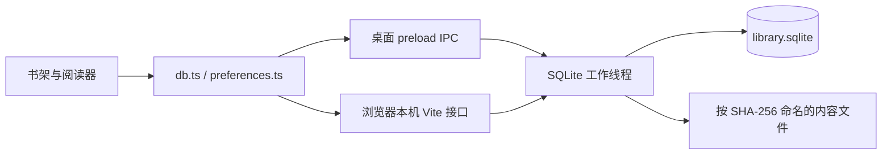

# Leaf SQLite 存储与后续 Agent 扩展

当前书籍、批注、阅读状态和偏好已统一使用 SQLite。IndexedDB 仅由启动时的一次性迁移程序读取，导入完成后删除旧库；无双写、备用旧库或运行时回退。Agent 和向量功能属于后续范围。

## 运行边界



`electron/storage/client.cjs` 管理工作线程请求，`library.cjs` 拥有业务操作与 SQL，`content.cjs` 管理文件上传、占用及回收。只暴露允许的业务操作，不接受任意 SQL 或文件路径。桌面验证调用主 frame 和来源；浏览器接口只接受 loopback 主机、同源 POST 和自定义请求头，cookie 按浏览器上下文隔离书库。

SQLite 使用 Electron 内置 `node:sqlite`。同步 API 在工作线程执行，主进程和 React 不执行 SQL。开发命令使用 Node >=22.13，需留意该版本的 SQLite API 仍有实验性提示。[Node SQLite](https://nodejs.org/api/sqlite.html)

| 环境                      | 数据位置                                                   |
| ------------------------- | ---------------------------------------------------------- |
| 正式桌面                  | 已有 Leaf/Folio 用户目录下的 `library/`                    |
| Electron 开发             | `Leaf Development/library/`                                |
| 浏览器开发和 Vite preview | `.leaf-data/<cookie-id>/`，或 `LEAF_BROWSER_DATA` 指定目录 |
| 自动化测试                | 临时 `LEAF_USER_DATA`；浏览器数据按上下文隔离              |

每个书库包含 `library.sqlite`、`content/`、`staging/`，升级备份进入 `backups/`。浏览器模式依赖本机 Node 服务，静态文件托管不支持持久化。开发目录不会自动合并正式应用或其他 origin 的旧数据。

## 数据结构与一致性

| 表                                         | 内容                                             |
| ------------------------------------------ | ------------------------------------------------ |
| `books`                                    | 标题、作者、格式、页数、封面、时间、当前页和收藏 |
| `book_contents`、`chapters`、`book_assets` | 原文引用、Markdown 章节及相对图片路径            |
| `content_objects`、`content_pins`          | 内容哈希、大小、上传或读取占用                   |
| `annotations`                              | 批注锚点、样式、笔记和几何矩形                   |
| `bookmarks`、`reading_states`              | 书签位置和完整续读状态                           |
| `preferences`                              | 设置、面板宽度、批注颜色和示例书初始化标记       |
| `schema_migrations`                        | 结构迁移编号、名称、脚本校验值和应用时间         |
| `legacy_imports`、`legacy_cache`           | 一次性导入的来源摘要和保留的旧 OCR 缓存          |

业务列规范化存储；扩展标记、位置、矩形等结构化载荷使用 JSON。PDF 与图片保存在不可变内容文件中，避免元数据修改重写正文。单个文件上限 512 MiB，IPC/HTTP 以 1 MiB 分块传输。

文件先写入暂存目录，校验大小、计算 SHA-256、同步到磁盘并发布，再提交数据库引用。上传占用持续到引用事务成功或主动释放；读取占用持续到整次读取结束。回收与所有引用变更在同一工作线程串行执行，只清理无引用且无占用的内容。异常退出后清理过期上传与进程占用。删除书籍通过外键清理批注、书签、章节、图片引用和阅读状态；文件在下一次回收时释放。

开启 `foreign_keys=ON`、WAL、`synchronous=FULL` 和有界 busy timeout。批注替换、书籍内容更新及旧库导入均在事务中完成，任一约束失败整次回滚。已删除书籍的迟到进度写入被忽略。

界面启动前加载偏好到内存；读设置不依赖浏览器存储。桌面退出先触发阅读位置和笔记的提交回调，再排空请求队列、关闭连接。保存失败或超时保留窗口。浏览器标签页无法提供同等退出握手，开发测试应等待保存完成后关闭。

## 一次性旧数据迁移

1. 在业务界面挂载前读取当前 origin 的旧数据，兼容正文内嵌在 `books` 的旧结构及 v5 的 `bookContents`。保留书籍 ID、批注、图片、章节、书签、阅读位置和 `folio-*` 偏好。
2. 对记录、键集合和正文计算摘要，分块上传文件；再次读取并对比源摘要，源变化时停止。
3. 在一个 SQLite 事务中导入全部记录并记录来源摘要。失败保留原库；未提交的内容可由回收清理，下次启动重新导入。
4. 提交后再次核对源摘要。相同来源重试以凭据判断是否已提交，不重复覆盖 SQLite。来源变化或 ID 冲突时停止并保留原数据。
5. 删除旧 `folio-library`，再移除旧 localStorage 偏好。旧连接阻塞删除时提示关闭旧窗口并重启，业务界面不会开始运行。

源库已删除但偏好清理中断时，根据已导入偏好完成清理。SQLite 启用后不从旧库持续同步；不支持把新数据自动降级到旧版本。

迁移使用当前来源的一次逻辑快照和一次原子提交，失败从头重试，没有逐书断点续传。摘要时一次处理一个 Blob，但仍需要保留全库记录快照；非常大的书库需另行实现流式导出和持久化检查点。浏览器开发迁移应关闭其他旧版本标签页；首尾摘要用于检测变化，不能替代对不合作旧客户端的跨版本写锁。

## 后续改表方式

在 `electron/storage/schema.cjs` 末尾追加编号连续的迁移。已发布 SQL 不修改，修复通过新迁移完成。启动时核对历史校验值和 `user_version`；较新库或记录不一致时拒绝写入。

新增表、可空列或默认值字段通常是小型迁移。复杂类型转换、约束变更、拆表采用新建目标表、复制转换、替换和重建索引的事务流程。DDL、外键校验、迁移记录和版本号一并提交，失败整体回滚；升级链从最后已提交版本继续。[SQLite ALTER TABLE](https://www.sqlite.org/lang_altertable.html)

已有库升级前生成数据库与内容目录备份。首次创建不备份空库。今后大规模数据回填应另设任务与检查点；模型变化或向量重新计算不放进启动时 DDL 事务。本次没有预建 Agent 表、向量表或通用后台迁移框架。

## 备份与恢复

备份使用 `VACUUM INTO` 生成一致的数据库副本，并复制该快照引用的内容；检查哈希、完整性和外键，最后写入有效清单。工作线程处理备份期间不执行写入或文件回收。备份较大时会阻塞该线程，因此维护脚本在应用退出后使用。[SQLite 备份说明](https://www.sqlite.org/backup.html)

```sh
node scripts/library-backup.mjs backup /path/to/profile/library /path/to/new-backup
node scripts/library-backup.mjs restore /path/to/new-backup /path/to/new-library
```

恢复只允许新目标目录，在暂存目录中校验迁移历史、引用和内容后再发布。不会覆盖正在使用的书库。将恢复目录作为关闭应用后的书库目录切换来源，并保留原目录；本次没有加入设置页备份按钮或运行中原地恢复。不能只复制 WAL 模式下的 `.sqlite` 文件来代替完整备份。

## 验证与发布边界

单元测试覆盖事务失败回滚、重启恢复、元数据更新不重写文件、上传/读取占用与回收、删除级联、旧源摘要幂等、迁移历史校验和备份内容校验。浏览器端到端测试覆盖旧 PDF/Markdown/图片/批注/续读迁移及旧库删除。桌面测试覆盖真实 SQLite 落盘、退出保存与重新打开，生产 `file://` 测试覆盖导入、阅读、搜索和导出。

正式发布仍需 Windows 安装包验收、大书库迁移的空间/耗时测量及断电/磁盘故障注入。自动化只使用隔离测试目录，不直接改动用户真实书库。

## 后续： Agent 数据的扩展方向

以下实体在 Agent 功能设计明确后增加，不在首轮迁移中预建空表。

| 实体       | 需要保存的信息                                      |
| ---------- | --------------------------------------------------- |
| 会话       | 标题、创建时间、更新时间、关联书籍与 Agent 配置版本 |
| 消息       | 会话、角色、有序序号、内容块、完成/中断状态和时间   |
| 运行       | 一次执行的状态、父运行、开始与结束时间、错误摘要    |
| 工具调用   | 运行、调用 ID、工具名、参数、状态、输出引用和耗时   |
| 附件与产物 | 消息/运行关联的内容对象引用                         |
| 后台任务   | 任务类型、输入版本、进度、重试次数、取消和恢复状态  |

对话、运行、工具调用分开建模，避免只保存最终回答而丢失执行轨迹。消息内容块、工具参数等变化较多的结构可以用 JSON，排序、状态、外键和时间仍使用可查询列。

流式输出在内存中展示并定期批量持久化，正常结束或取消时保存最后一批。异常退出后保留已保存内容，并将未完成运行标记为中断。工具调用用稳定 ID 去重；恢复运行不能盲目重放可能已经产生外部副作用的工具。

## 后续： 向量存储与检索

SQLite 原生能够在 BLOB 列保存向量，但普通 BLOB 列不自带相似度检索或近似最近邻索引。建议以 float32 的二进制表示保存向量；字节序、维度和序列化格式需固定，并验证长度和非有限数值。

一个 1024 维 float32 向量占 4096 字节，即 4 KiB；10 万个向量的原始数据约为 391 MiB，尚未计入文本、元数据、索引与数据库开销。因此“能够存储”不等于“大规模检索已经足够快”。

后续向量阶段建议增加：

| 实体         | 职责                                                       |
| ------------ | ---------------------------------------------------------- |
| 文档文本版本 | 文档哈希、提取/OCR 算法版本、canonical 文字索引版本        |
| 文本块       | book ID、来源页/章、起止偏移、文字、内容哈希、分块策略版本 |
| 嵌入空间     | 模型与版本、维度、数值类型、归一化规则、距离度量           |
| 嵌入         | 文本块、嵌入空间、向量、生成时间与任务版本                 |
| 检索索引     | 对指定嵌入空间构建的可重建检索结构                         |

不同模型产生的向量不能直接混在一个距离排序中，即使维度相同。修改模型、文字提取或分块规则后，新建版本并重建相关索引；在新索引完整可用前继续使用旧版本，成功后切换当前版本。

原始嵌入 BLOB 保存在普通业务表中，检索结构作为可重建索引。这会增加存储开销，但让升级扩展、重建索引与更换实现更可控；后续可根据容量测量重新决定是否保留双份向量。

`sqlite-vec` 是首个候选：支持向量 BLOB、距离计算与 `vec0` KNN 查询。它仍处于 pre-v1，需锁定经过验证的版本并隔离扩展相关 SQL。[项目说明](https://github.com/asg017/sqlite-vec)、[KNN 文档](https://alexgarcia.xyz/sqlite-vec/features/knn.html)

不把 `sqlite-vec` 当作已经验证的大规模 ANN 引擎。进入选型阶段后，用固定向量与真实文档在 1 万、10 万以及预期上限规模测量检索延迟、内存、写入速度、过滤正确性与取消响应，再确定其适用范围；如果不足，替换检索实现，不迁移书籍与 Agent 数据模型。

每次查询携带请求 ID、范围、嵌入空间和截止时间。在同一个只读事务内选定当前已发布索引版本、检索并取回来源信息，避免查询期间切换版本造成混合结果。旧索引在仍有查询使用时保留，查询结束或查询进程退出后才允许回收。

取消先移除尚未执行的查询；已进入同步计算的查询必须有可验证的终止方式。不能依赖给阻塞中的执行线程发送一条普通消息来中断，也不能把丢弃过期结果当作计算已取消。若所选运行库或扩展没有可靠的查询中断能力，由独立进程执行查询，达到截止时间后结束并重建该进程；不终止写入线程。查询服务同时约束并发和只读事务持续时间，防止长时间占用快照导致 WAL 持续增长。

查询进程只加载应用随包分发、版本锁定的向量扩展。扩展不可用时返回明确的语义检索不可用状态，基本阅读与写入服务继续工作。查询结果返回后，业务层再次确认书籍仍存在且属于请求范围。

检索要先确定书籍范围与嵌入空间，再返回文字块、距离和来源锚点。不能只在全库 Top-K 后过滤书籍范围，否则可能漏掉范围内的相关结果。向量生成由嵌入模型承担，SQLite 不负责把 PDF 自动变成向量。

跨书关键词检索可用 FTS5，后续与向量检索融合排序。FTS5 的中文分词、短语和子串行为需专门验证，不能假定默认分词器满足中文阅读需求；阅读器已有精确搜索仍保留。[FTS5 文档](https://www.sqlite.org/fts5.html)
