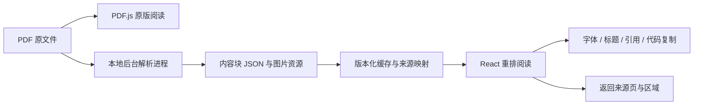

# PDF 重排阅读可行性调研

调研日期：2026-09-28。

目标是让 Leaf 中的 PDF 内容能够使用自定义字体、标题和正文样式、引用样式，以及带复制按钮的代码块，同时保留文中的图片和返回原文的能力。

结论：技术上可实现。建议以 Docling 作为首个验证对象，MinerU 作为对照，增加独立的重排阅读模式。已有解析器能够提供内容块、阅读顺序、图片资源和来源位置；产品接入仍需要后台解析、缓存、来源映射和质量回退。普通文本阅读与图片展示适合作为第一阶段，精确的双模式批注同步应单独验证。

本次完成了官方文档、官方示例及部分类型定义的核查，并检查了 Leaf 的渲染、存储、搜索、定位和批注代码。没有安装解析模型或执行文档转换，没有测得识别准确率、解析耗时、峰值内存及安装包体积。文档中的实现难度是工程判断，验收门槛是建议目标，均不是实测结果。官方文档和 main 分支可能领先于发行版本，验证时需要锁定软件、模型和配置版本。

## 1. 能获得哪些内容和关系

PDF 原生文字和绘图对象提供内容与位置；结构标签存在时可作为额外依据。版面模型和 OCR 则用于恢复缺失的结构。不能假设解析输出完整复现作者的源文档。

| 需求                 | 可用的信息或实现路径                      | 需要验证的边界                                           |
| -------------------- | ----------------------------------------- | -------------------------------------------------------- |
| 正文与自定义字体     | 解析文字块，在 React 中按段落渲染         | 阅读顺序、跨页合并、断词、双栏和中英文混排               |
| 标题样式与目录       | 标题类型，结合目录、编号和字体推断层级    | 检测到标题与确定标题层级是两项能力                       |
| 代码块与复制         | 代码类型、文本，部分模型还输出语言        | 字符、换行、缩进和长行折行；识别结果不能保证可以直接运行 |
| 图片展示             | 检测图形区域，导出图片，保留页码和区域    | 区域裁切是否完整，图注关联是否正确，图片是否重复         |
| 引用样式             | 利用 PDF 标签、缩进和版面特征进行补充分类 | 不能假定通用解析器稳定输出独立的引用类型                 |
| 返回原文             | 来源页码和边界框                          | 原点、旋转、裁切及单位转换；块级位置不等于逐字符位置     |
| 图片与正文的语义关系 | 结合图号、正文引用和图注分析              | “图出现在段落附近”不等于“图解释该段落”                   |

Docling 的文档模型包含文本、图片、表格、父子引用和来源位置，阅读顺序由正文树及子节点顺序表达。这适合作为重排输入，但数据结构能表达层级并不代表每个 PDF 都能准确恢复层级。[官方文档模型](https://docling-project.github.io/docling/concepts/docling_document/)

## 2. Docling：优先验证对象

官方项目提供版面、阅读顺序、表格、代码及图像处理，并能导出 Markdown、HTML 和 JSON，支持本地运行。[官方项目](https://github.com/docling-project/docling)

### 图片

官方示例开启 `generate_picture_images`，遍历 `PictureItem`，通过 `get_image()` 保存 PNG，还可将图片作为资源引用到 Markdown 或 HTML。这确认了“识别图形区域并导出供阅读器显示”有现成实现路径。[图片导出示例](https://docling-project.github.io/docling/_generated/examples/export_figures/)

需要区分两个目标：

- **展示文中的插图**：识别完整图形区域并渲染、裁切；可以包含矢量线条、图中文字及多个嵌入对象。
- **枚举原始位图资源**：提取 PDF 内的嵌入位图，可能包括背景、图标、扫描页及装饰对象；数量不一定等于读者理解的插图数量。

Docling 当前文档另有 NativePdfPipeline，描述为每个原生文字单元对应一个文字项、每个嵌入位图对应一个图片项，不运行版面或 OCR 模型。因此，轻量资源提取与结构恢复应按不同能力评估。[原生内容提取说明](https://docling-project.github.io/docling/usage/advanced_options/#extract-the-native-content-of-a-pdf)

### 标题和代码

标题层级恢复是可选阶段，默认关闭；启用后结合 PDF 目录、编号和视觉样式推断层级。字体依据还要求保留解析页面。这意味着不能直接把默认输出中的标题级别当作最终章节层级。[标题层级说明](https://docling-project.github.io/docling/usage/heading_levels/)

代码增强有独立官方示例，通过 `do_code_enrichment=True` 启用，并演示 CodeFormulaV2 与 Granite Docling 预设，输出 `CodeItem.text` 和 `code_language`。第一轮应分别检查基础解析和增强解析的字符与格式差异，不能仅凭出现代码块类型判断复制质量。[代码增强示例](https://docling-project.github.io/docling/_generated/examples/code_formula_granite_docling/)

当前 DocItemLabel 定义有 code、caption、title、section_header 和 text 等类型，没有单独的 blockquote 类型；引用块需要额外设计识别或用户修正机制。这是对类型定义的观察，不代表其他后端或未来版本不能提供引用语义。[标签类型定义](https://github.com/docling-project/docling-core/blob/main/docling_core/types/doc/labels.py)

### 部署

Docling 是 Python 工具链，模型依赖 PyTorch。官方支持 macOS、Windows 和 Linux，但 Intel Mac 有特定的 PyTorch 兼容说明。因此不能将它视为安装一个前端 npm 包；Leaf 需要一个受控的本地解析进程及相应运行时。[安装说明](https://docling-project.github.io/docling/getting_started/installation/)

模型默认首次使用时下载，也支持预取后指定本地模型路径。Leaf 若保持离线定位，可以预装或由用户下载解析组件，然后离线解析；首次安装模型与每次文档解析应是独立流程。[离线配置说明](https://docling-project.github.io/docling/usage/advanced_options/#model-prefetching-and-offline-usage)

Docling 提供页级及文档级转换质量信息，可作为质量回退的辅助信号；它不能替代对代码内容或阅读顺序的实际检查。[质量信息说明](https://docling-project.github.io/docling/concepts/confidence_scores/)

代码库采用 MIT，模型许可需按选用模型分别核对，不能从代码库许可推导所有模型的分发条件。[官方发布说明](https://pypi.org/project/docling/)

## 3. MinerU：对照验证对象

当前官方文档描述了 Flash、Basic、Standard 和 Advanced 解析档位，并提供 Python SDK 和 HTTP API。Basic 使用小模型，Standard 和 Advanced 结合视觉语言模型；各档位的输出质量和运行成本应分开测试。[档位和运行时](https://opendatalab.github.io/MinerU/usage/tiers/)

官方输出契约支持保存 Markdown、结构化内容、中间 JSON 和 images 资源目录，并保留来源页和块信息。单独的 JSON 不一定包含完整图片资源，接入必须保存输出资源包或显式物化图片，不能只缓存一份 Markdown 字符串。[输出契约](https://opendatalab.github.io/MinerU/reference/output_files/)

官方针对 Apple Silicon 推荐至少 16 GB 统一内存及直接 macOS 安装；较高吞吐的本地部署同样建议至少 16 GB 系统内存。这是部署规划要求，不是我们设备上的性能结果。低配置 Windows、长书和并发任务需要另外验收。[资源和平台边界](https://opendatalab.github.io/MinerU/usage/tiers/#resources-and-platform-boundaries)

当前主分支许可文本为 Apache 2.0 加附加条款，包含商业规模门槛和在线服务标识条件；历史版本可能采用不同许可。选型时需核对所锁定版本和模型的实际许可文件。[当前许可文本](https://github.com/opendatalab/MinerU/blob/master/LICENSE.md)

没有实测证据支持“MinerU 比 Docling 更准”或反过来的结论。推荐顺序基于 Leaf 接入目标、输出结构和部署路径，而不是准确率排名。

## 4. 与当前 Leaf 的接入点

当前项目是 Electron、React、PDF.js 和 SQLite 的本地阅读器，原版渲染链已经完整。重排建议新增独立链路，并复用书籍身份及原 PDF。

| 现有位置                                            | 当前行为                              | 重排需要增加的能力                               |
| --------------------------------------------------- | ------------------------------------- | ------------------------------------------------ |
| `src/lib/pdf.ts:23`                                 | 提取文字、字号、位置和结构树          | 将解析器结果转换成 Leaf 内容块                   |
| `src/lib/text.ts:66`                                | 建立搜索、标注使用的稳定文字索引      | 保持现有索引，另存重排文字及来源映射             |
| `src/features/reader/viewport/PDFPage.tsx:75`       | Canvas 绘制原页面，TextLayer 负责选字 | 增加按语义块渲染的 React 视图                    |
| `src/types.ts:64`                                   | PageContent 只有文字、tokens 与页尺寸 | 增加块类型、顺序、层级、图片引用、来源及质量字段 |
| `src/lib/db.ts:3`                                   | books、annotations、兼容 OCR 仓库     | 新建版本化重排缓存和资源存储                     |
| `electron/main.cjs:67`                              | 沙箱 Renderer，主进程负责文件 IPC     | 主进程启动解析子进程，传递任务、进度和结果       |
| `src/features/reader/hooks/useDocumentSearch.ts:53` | 搜索原 PDF 索引并返回文字偏移         | 搜索重排块，或将原结果映射到重排块               |
| `src/lib/selection.ts:18`                           | DOM 选区转换为原 PDF 矩形             | 重排选区建立块内文字锚点，再尝试映射到原文       |
| `src/lib/position.ts:52`                            | 通过来源页和原文字偏移恢复位置        | 两种模式分别保存位置，用来源锚点切换             |

数据库目前升级时会删除旧 documents 仓库。因此必须显式迁移并使用新仓库，不能直接把新结果写进旧名称。

建议处理链路：

解析任务按需启动，并提供进度、取消和失败处理。首次转换完成后缓存；后续打开使用缓存。缓存键包含 PDF 指纹、解析器版本、模型版本、配置和 Leaf 数据格式版本；书籍删除时同步删除资源。图像按区域生成，避免为整本书永久保存高分辨率页面。

内部数据至少要保留：稳定块 ID、块类型、文本、阅读顺序、可选标题层级和语言、图片资源引用、图注引用、来源页与边界框、可选原文偏移映射，以及解析版本和质量状态。Markdown 可用于导出，但不足以作为搜索、定位和批注的唯一数据源。

## 5. 最需要解决的三个问题

### 代码复制的可信度

代码块识别、复制按钮和字符准确性是不同问题。数字 PDF 应优先保留可验证的原生文字；模型结果与原文不一致时应保留区别及来源，不能静默改写代码。扫描代码仍受 OCR 或模型识别影响，尤其是引号、反斜线、缩进和长行。默认不自动格式化复制内容。

### 图片与段落的对应

第一阶段保留解析器给出的顺序、图片和图注引用。需要能回到原页确认完整性。正文跨页提图、图片远离图注、多图共享图注等情况不能仅靠邻近规则关联；不要将推断出的语义关系当作原文事实。

### 搜索、批注和定位的一致性

当前批注保存原文字 start/end 和 PDF rects。另一套解析器可能合并段落、修复断词、改变空白或使用 OCR，文字偏移会不同。整块边界框只能支持块级返回，不能保证将重排中的任意字符选区精确导出为原 PDF 高亮。

建议第一阶段验证只读重排、复制、字号调整和来源跳转。已有笔记可通过页码或确认后的块映射定位；没有足够证据时展示来源入口。精确的重排高亮、原版同步显示和 PDF 批注导出应在字符映射验证完成后开放，不用整块高亮假装精确匹配。

## 6. 验证方案与决策标准

当前仓库的八份样例由 `scripts/samples.mjs` 生成，主要是英文单栏正文和封面图形，没有足够的代码、扫描页及复杂图注案例，适合回归，不适合据此判断解析质量。

建议最小验证集包含：中文普通文档、英文普通文档、含真实代码的技术文档、代码截图、双栏论文、含位图和矢量插图的文档、跨页段落/图注、扫描文档，以及一份长书。选取有权限在本机处理的文件，标注其中至少 30 页；不用在线上传作为默认路径。

分三步验证：

1. **解析器输出验证**：Docling 与 MinerU 使用同一批 PDF，锁定版本和配置，记录标题、正文、代码、图片、图注、来源位置与失败页；保留原始输出，检查基础与增强模式的差异。
2. **最小阅读原型验证**：转换成统一数据格式，展示字体调整、标题、代码复制、图片和原文跳转；检查长文档滚动、取消、缓存重开和资源占用。
3. **产品一致性验证**：测搜索、原版切换、续读和批注映射，再决定哪些文档类型开放重排及哪些功能需要降级。

建议验收指标如下，正式阈值应结合真实样本调整：

| 指标       | 建议检验方式                                                                                       |
| ---------- | -------------------------------------------------------------------------------------------------- |
| 正文完整性 | 对照标注内容检查漏段、重复及错序，逐类报告错误                                                     |
| 代码复制   | 测试集中被认可的代码块，字符、换行和缩进逐项与源文件或人工核对文本比较；不能用语法检查替代内容比较 |
| 图片       | 统计应展示的插图检出和错误检出，人工检查边界、顺序、图注及清晰度                                   |
| 标题       | 单独统计标题检出和层级准确性                                                                       |
| 来源定位   | 检查每个已展示块能否返回正确页和区域；坐标原点、旋转页和裁切页必须覆盖                             |
| 性能       | 记录冷启动、模型已加载时转换、每页耗时、首批可读内容时间、峰值内存、缓存和分发体积                 |
| 交互       | 解析期间原版仍可阅读，取消/关闭后停止任务，缓存重开无需再次解析                                    |
| 跨平台     | macOS Apple Silicon、需支持时的 Intel Mac、Windows CPU 环境各自验收                                |
| 批注       | 精确字符映射有独立通过标准；无法通过时维持原版标注能力                                             |

第一阶段通过条件是：目标文档类别能保留主要内容、提供可信的复制结果、展示插图并正确返回原文，同时资源占用可接受。复杂页失败应保留原版入口，并允许按文档或页面选择展示方式。

## 7. 落地建议

优先制作 Docling 本地解析到 Leaf 内容块的验证原型，同时保留解析器适配层以便用 MinerU 对照。第一版范围为标题、正文、图片、代码块复制、自定义字体和原文跳转，引用分类作为单独的识别验证项。

本地解析符合 Leaf 当前无需账户、文件保存在本机的定位，但新增 Python 运行时和模型的安装、更新、离线分发与跨平台打包是实际成本。云端解析可作为另外的产品选择，它会引入上传、服务成本与离线能力变化，不能作为本地失败时的隐式回退。

可进入原型阶段；在解析质量、代码复制和两平台资源数据出来前，不承诺对所有 PDF 提供统一的完整重排或精确批注同步。
